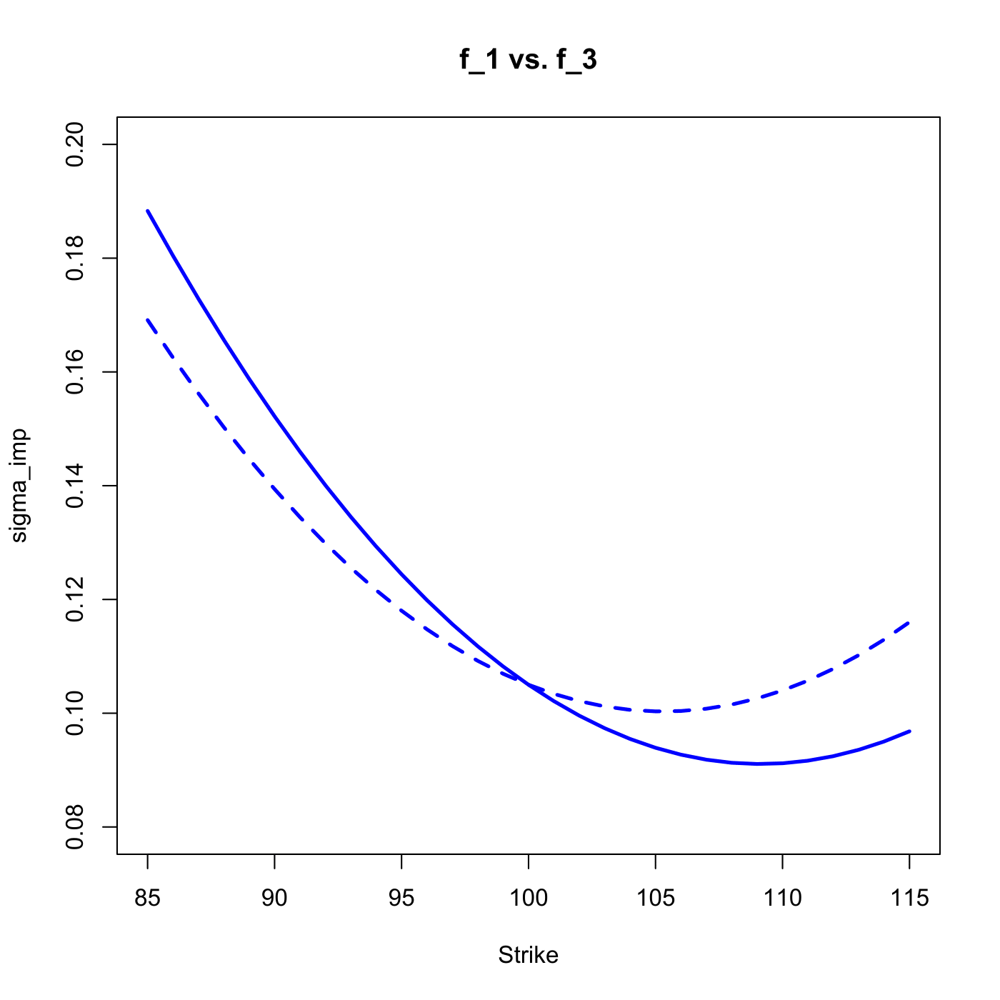

[](http://quantlet.de/)

## [](http://quantlet.de/) **SFSriskreversal** [](http://quantlet.de/)

```yaml

Name of QuantLet : SFSriskreversal

Published in : 'Statistics of Financial Markets : Exercises and Solutions'

Description : 'Compares the prices of the risk reversal functions for the following implied
volatility curves, given as a function of strike price: (i) f1(K) = 0.000167 x K^2 - 0.03645 x K +
2.080 (ii) f2(K) = 0.000167 x K^2 - 0.03645 x K + 2.090 (iii)f3(K) = 0.000167 x K^2 - 0.03517 x K +
1.952. The plots compare the functions f2 and f3 to the function f1.'

Keywords : financial, implied-volatility, option, volatility, risk, graphical representation, plot

See also : SFScalendarspread, SFSinterpolMaturity, SFSinterpolStrike, SFSstickycall

Author : Lasse Groth

Submitted : Fri, September 30 2011 by Awdesch Melzer

Output : The prices of risk reversal for functions f1, f2 and f3.

Example: 
- 1: Comparison of the implied volatility functions f1 and f3 with respect to the strike price
- 2: Comparison of the implied volatility functions f1 and f2 with respect to the strike price

```





### R Code:
```r

# clear variables and close windows
rm(list = ls(all = TRUE))
graphics.off()

# parameter settings
S0     = 100                # Closing price of underlying at time t_0
strike = seq(85, 115, 1)    # range of strike prices
tau    = 0.25               # time to maturity
r      = 0.02               # interest rate

# define risk reversal
i1 = 1
i2 = 31

# define functions
f1 = function(x) 0.000167 * x^2 - 0.03645 * x + 2.08   # initial
f2 = function(x) 0.000167 * x^2 - 0.03645 * x + 2.09   # shifted
f3 = function(x) 0.000167 * x^2 - 0.03517 * x + 1.952  # tilt

# Calculation of call option price by BS model
call_blsprice = function(S0, strike, r, tau, sigma) {
    d1 = (log(S0/strike) + (r + sigma^2/2) * tau)/(sigma * sqrt(tau))
    d2 = d1 - sigma * sqrt(tau)
    call_blsprice = S0 * pnorm(d1) - strike * exp(-r * tau) * pnorm(d2)
}

# Calculation of put option price by BS model
put_blsprice = function(S0, strike, r, tau, sigma) {
    d1 = (log(S0/strike) + (r + sigma^2/2) * tau)/(sigma * sqrt(tau))
    d2 = d1 - sigma * sqrt(tau)
    put_blsprice = strike * exp(-r * tau) * pnorm(-d2) - S0 * pnorm(-d1)
}

# calculate
ivsmileK = f1(strike)
call1 = call_blsprice(S0, strike[i1], r, tau, ivsmileK[i1])
put1 = put_blsprice(S0, strike[i1], r, tau, ivsmileK[i1])
call2 = call_blsprice(S0, strike[i2], r, tau, ivsmileK[i2])
put2 = put_blsprice(S0, strike[i2], r, tau, ivsmileK[i2])
RR1  = round(put1 - call2, 4)

ivsmileK = f2(strike)
callS1 = call_blsprice(S0, strike[i1], r, tau, ivsmileK[i1])
putS1 = put_blsprice(S0, strike[i1], r, tau, ivsmileK[i1])
callS2 = call_blsprice(S0, strike[i2], r, tau, ivsmileK[i2])
putS2 = put_blsprice(S0, strike[i2], r, tau, ivsmileK[i2])
RR2  = round(putS1 - callS2, 4)

ivsmileK = f3(strike)
callS1 = call_blsprice(S0, strike[i1], r, tau, ivsmileK[i1])
putS1 = put_blsprice(S0, strike[i1], r, tau, ivsmileK[i1])
callS2 = call_blsprice(S0, strike[i2], r, tau, ivsmileK[i2])
putS2 = put_blsprice(S0, strike[i2], r, tau, ivsmileK[i2])
RR3  = round(putS1 - callS2, 4)

# final results
print("Prices of risk reversal")
print("  f1    f2     f3")
print(c(RR1, RR2, RR3))

# difference f1 vs. f2
plot(strike, f1(strike), type = "l", lwd = 2.5, col = "blue", ylim = c(0.08, 0.2), 
    xlab = "Strike", ylab = "sigma_imp")
lines(strike, f2(strike), lwd = 2.5, col = "blue", lty = 2)
title("f_1 vs. f_2")

# difference f1 vs. f3
dev.new()
plot(strike, f1(strike), type = "l", lwd = 2.5, col = "blue", ylim = c(0.08, 0.2), 
    xlab = "Strike", ylab = "sigma_imp")
lines(strike, f3(strike), lwd = 2.5, col = "blue", lty = 2)
title("f_1 vs. f_3")
```
