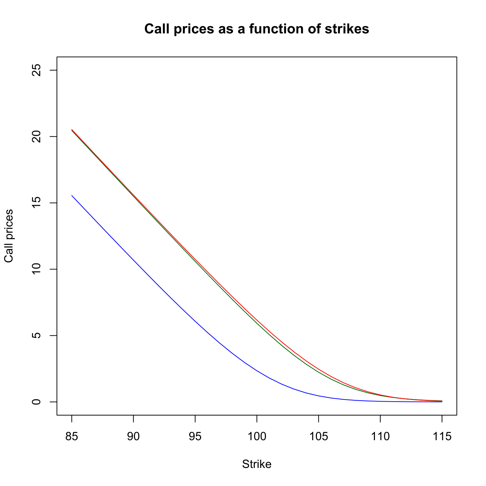
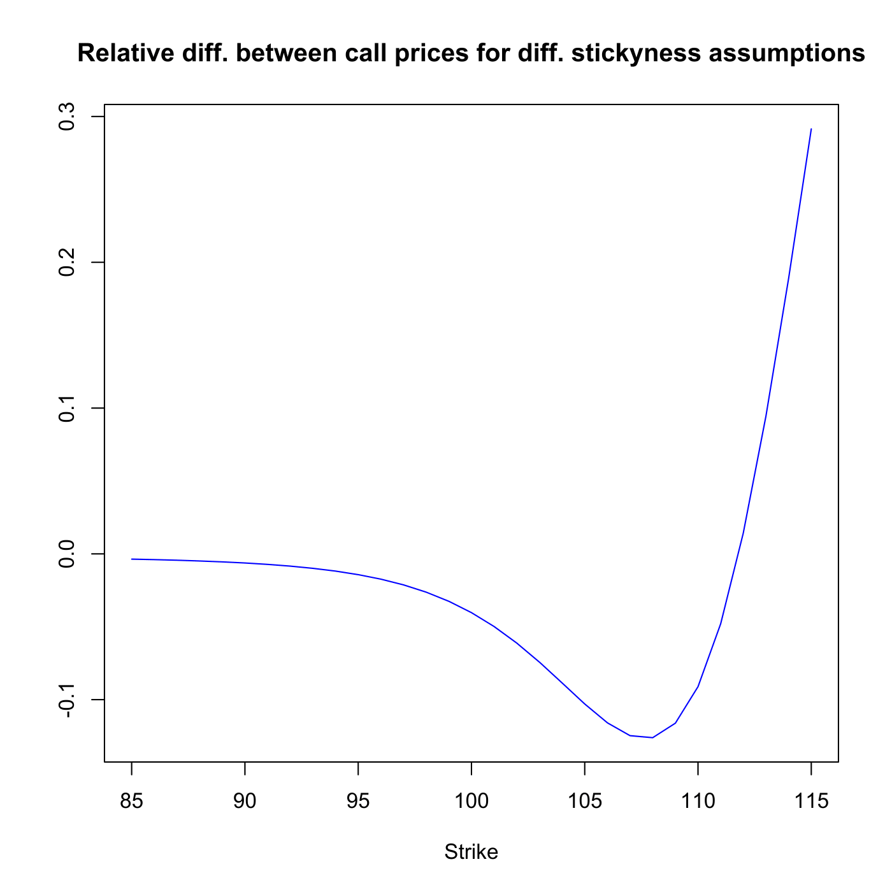
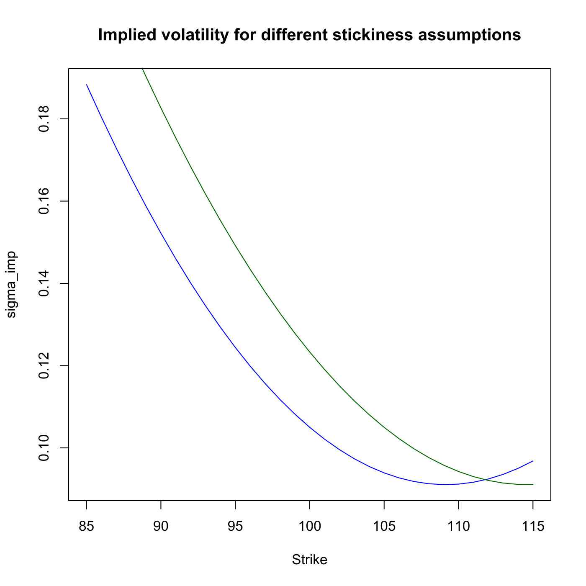

[](http://quantlet.de/)

## [](http://quantlet.de/) **SFSstickycall** [](http://quantlet.de/)

```yaml

Name of QuantLet : SFSstickycall

Published in : 'Statistics of Financial Markets : Exercises and Solutions'

Description : 'Plots call option prices as a function of strikes for 85<K<115. The implied
volatility function may be fixed to the strike prices (sticky strike) or moneyness K/S (sticky
moneyness). Compares the relative difference of both approaches.'

Keywords : 'financial, implied-volatility, interpolation, linear, approximation, option,
volatility, risk, graphical representation, plot, moneyness, strike'

See also : SFScalendarspread, SFSinterpolMaturity, SFSinterpolStrike, SFSriskreversal

Author : Lasse Groth

Submitted : Fri, September 30 2011 by Awdesch Melzer

Example: 
- 1: 'Call prices as a function of strikes for r = 2%, tau = 0.25. The implied volatility functions
curves are given as f(K) = 0.000167K^2 - 0.03645K + 2.08 (blue and green curves) and f*(K) =
f(KxS0/S1) (red curve). The level of underlying price is S0 = 100 (blue) and S1 = 105 (green,
red).'
- 2: Relative differences of the call prices for two different stickiness assumptions.
- 3: Implied volatility functions f(K) = 0.000167K2 - 0.03645K + 2.08 and f*(K) = f(KxS0/S1).

```








### R Code:
```r

# clear variables and close windows
rm(list = ls(all = TRUE))
graphics.off()

# parameter settings
S0     = 100              # Underlying price at time t_0
S1     = 105              # Underlying price at time t_1
strike = seq(85, 115, 1)  # range of strike prices
tau    = 0.25             # time to maturity
r      = 0.02             # interest rate

# Calculation of option price by BS model
blsprice = function(S0, strike, r, tau, sigma) {
    d1 = (log(S0/strike) + (r + sigma^2/2) * tau)/(sigma * sqrt(tau))
    d2 = d1 - sigma * sqrt(tau)
    blsprice = S0 * pnorm(d1) - strike * exp(-r * tau) * pnorm(d2)
}

# calculate
ivsmileK = 0.000167 * strike^2 - 0.03645 * strike + 2.08
callinit = blsprice(S0, strike, r, tau, ivsmileK)
callstickystrike = blsprice(S1, strike, r, tau, ivsmileK)
ivsmilemon = 0.000167 * (strike * S0/S1)^2 - 0.03645 * strike * S0/S1 + 2.08
callstickymon = blsprice(S1, strike, r, tau, ivsmilemon)

# plot
plot(strike, callinit, type = "l", col = "blue", xlab = "Strike", ylab = "Call prices", 
    ylim = c(0, 25))
lines(strike, callstickystrike, col = "dark green")
lines(strike, callstickymon, col = "red")
title("Call prices as a function of strikes")

dev.new()
plot(strike, (callstickystrike - callstickymon)/callstickystrike, type = "l", col = "blue", 
    xlab = "Strike", ylab = "")
title("Relative diff. between call prices for diff. stickyness assumptions")

dev.new()
plot(strike, ivsmileK, type = "l", col = "blue", xlab = "Strike", ylab = "sigma_imp")
lines(strike, ivsmilemon, col = "dark green")
title("Implied volatility for different stickiness assumptions")
```
