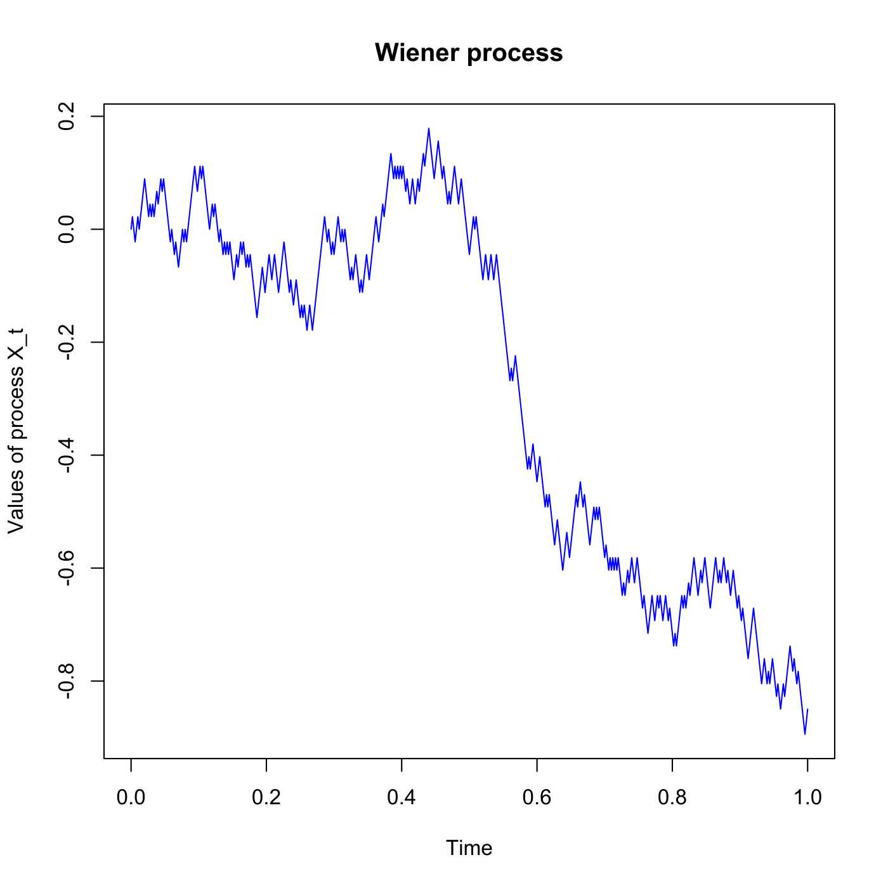

[](http://quantlet.de/)

## [](http://quantlet.de/) **SFSwiener2** [](http://quantlet.de/)

```yaml

Name of QuantLet : SFSwiener2

Published in : SFS

Description : Simulates a standard Wiener process X_t=c^(-0.5)*W_ct, for c>0.

Keywords : 'brownian-motion, continuous, graphical representation, plot, process, simulation,
standard, stochastic, stochastic-process, time-series, wiener-process'

See also : SFSwiener1, SFSwiener1, SFSwiener3, SFSwiener3

Author : Lasse Groth

Submitted : Wed, July 29 2015 by quantomas

Input: 
- dt: delta t
- c: constant

Example : Plot of a Wiener process X_t for dt=0.001, c=2.

```




### R Code:
```r
# clear variables and close windows
rm(list = ls(all = TRUE))
graphics.off()

wiener2 = function(dt, c) {
    l = 1
    n = floor(l/dt)
    t = seq(0, n * dt, c * dt)
    
    set.seed(0)
    z = runif(floor(n/c), 0, 1)
    z = 2 * (z > 0.5) - 1
    z = z * c^(-0.5) * sqrt(dt)  #to get finite and non-zero variance
    x = c(0, cumsum(z))
    
    listik = cbind(t, x)
    
    # output
    plot(listik[, 1], listik[, 2], type = "l", col = "blue", xlab = "Time", ylab = "Values of process X_t")
    title("Wiener process")
    
}

wiener2(0.001, 2) 

```
