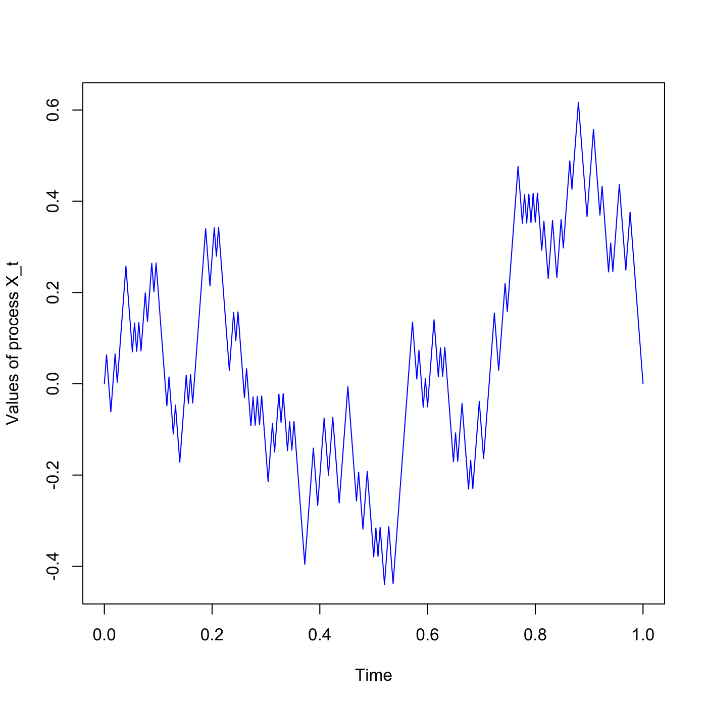

[](http://quantlet.de/)

## [](http://quantlet.de/) **SFSbb** [](http://quantlet.de/)

```yaml

Name of QuantLet : SFSbb

Published in : SFS

Description : Plots a sample path of Brownian Bridge U_t=W_t-tW_1 in interval [0, 1].

Keywords : 'brownian-motion, continuous, graphical representation, plot, process, simulation,
stochastic, stochastic-process, time-series, wiener-process'

See also : SFEGBMProcess, SFEbsbm, SFEfbmplot

Author : Zografia Anastasiadou

Submitted : Wed, July 29 2015 by quantomas

```




### R Code:
```r
# clear variables and close windows
rm(list = ls(all = TRUE))
graphics.off()

# Brownian Bridge main calculation
dt = 0.004
n  = 250
l  = 1
t  = seq(0, n * dt, dt)

set.seed(0)
z      = runif(n, min = 0, max = 1)
z      = 2 * (z > 0.5) - 1
z      = z * sqrt(dt)  # to get finite and non-zero varinace
z2     = dt * sum(z)
z      = z - z2
x      = c(0, cumsum(z))
listik = cbind(t, x)

# Output
plot(listik[, 1], listik[, 2], type = "l", col = "blue", xlab = "Time", ylab = "Values of process X_t") 

```
