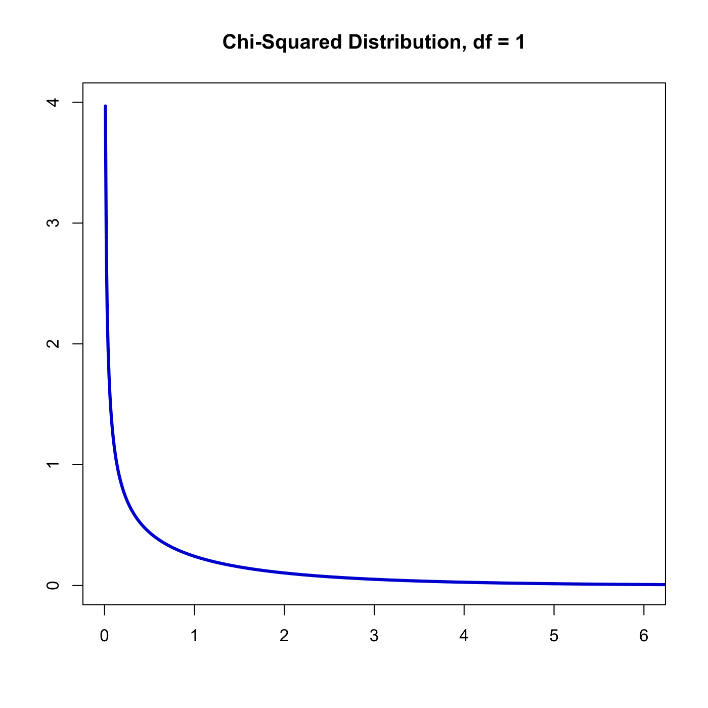
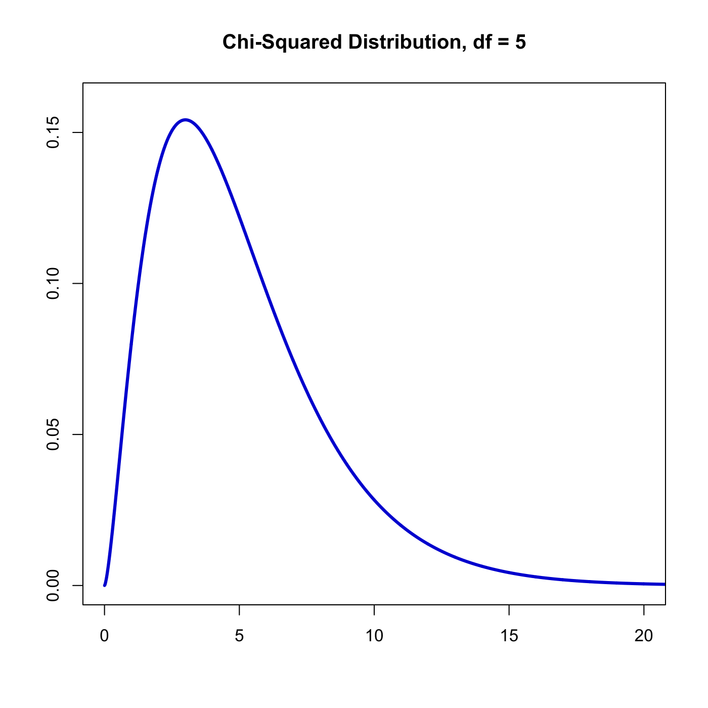

[](http://quantlet.de/)

## [](http://quantlet.de/) **SFSchisq** [](http://quantlet.de/)

```yaml

Name of QuantLet : SFSchisq

Published in : SFS

Description : 'Plots the probability density function (pdf) of the chi-squared distribution for
different degrees of freedom.'

Keywords : chi-square, density, distribution, graphical representation, pdf, plot, probability

Author : Awdesch Melzer

Submitted : Sun, August 02 2015 by quantomas

Example: 
- 1: Chi-squared pdf plot for df=1.
- 2: Chi-squared pdf plot for df=5.

```






### R Code:
```r
rm(list = ls(all = TRUE))
graphics.off()

x = seq(0, 40, 0.01)

# Plot of chi-squared distribution with one degree of freedom
df1 = 1
plot(x, dchisq(x, df = df1), type = "l", col = "blue3", lwd = 3, xlim = c(0, 6), 
    ylim = c(0, 4), xlab = "", ylab = "")
title(paste("Chi-Squared Distribution, df =", (df1)))

# Plot of chi-squared distribution with five degrees of freedom
dev.new()
df2 = 5
plot(x, dchisq(x, df = df2), type = "l", col = "blue3", lwd = 3, xlim = c(0, 20), 
    ylim = c(0, 0.16), xlab = "", ylab = "")
title(paste("Chi-Squared Distribution, df =", (df2)))
 

```
