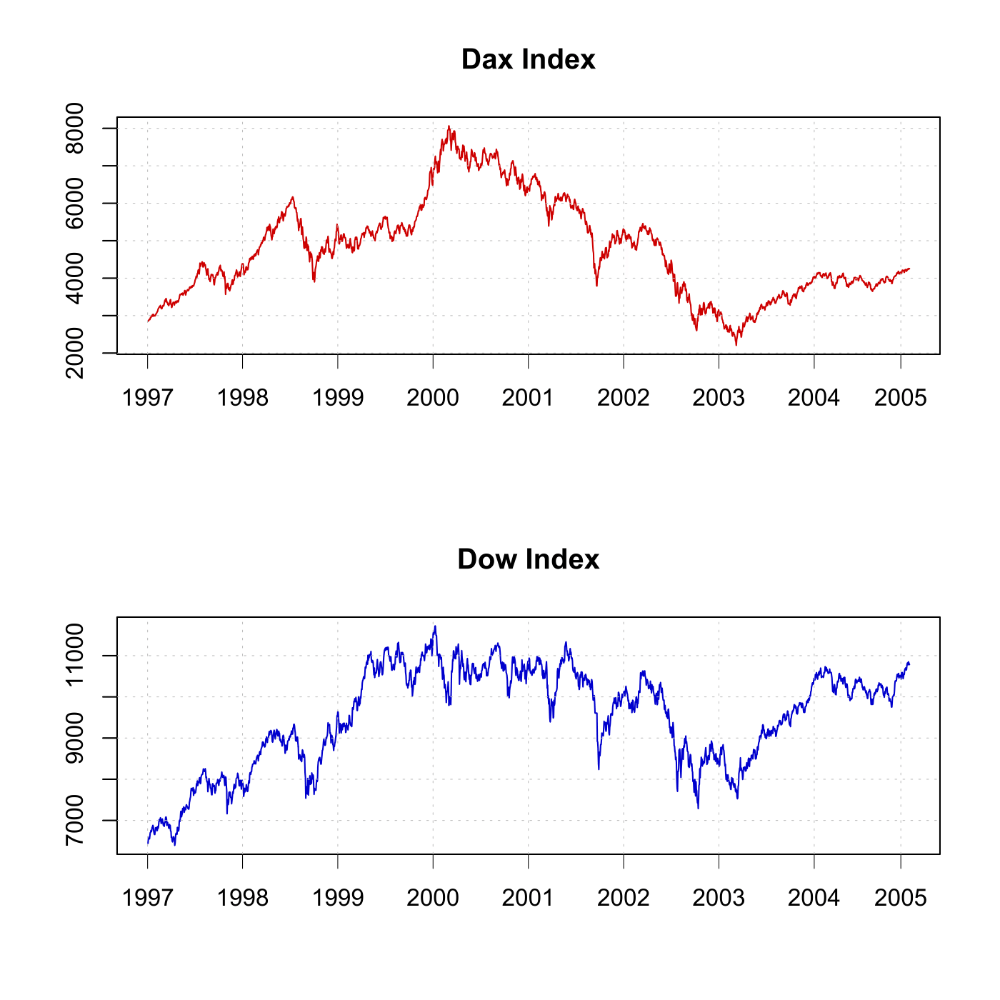
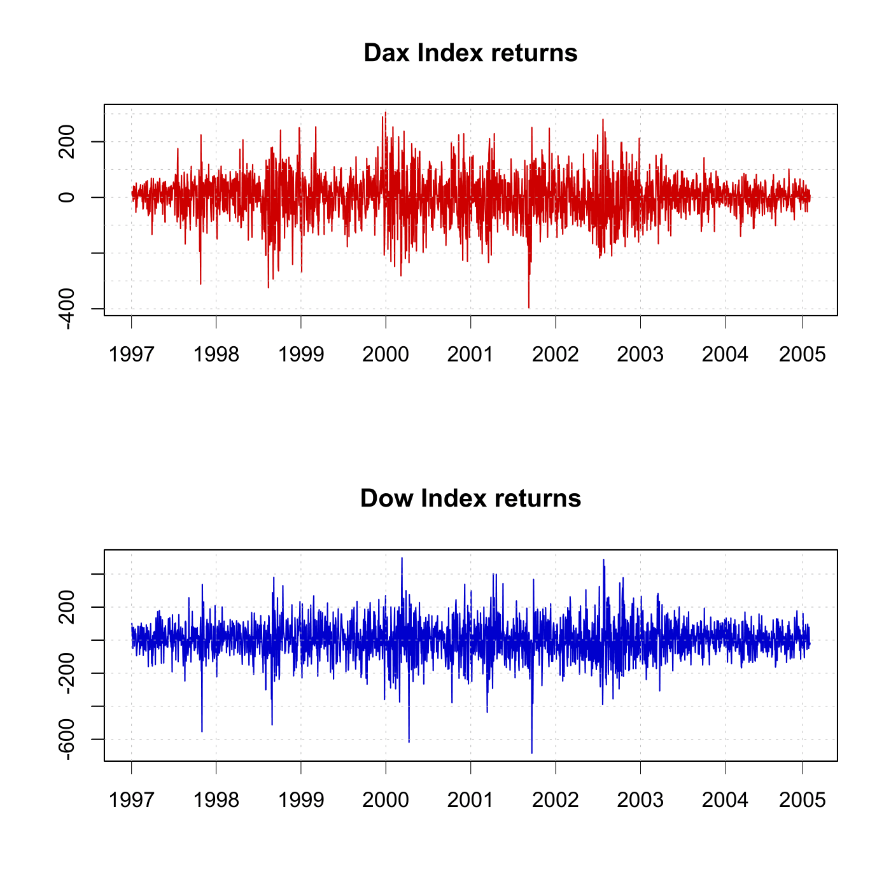
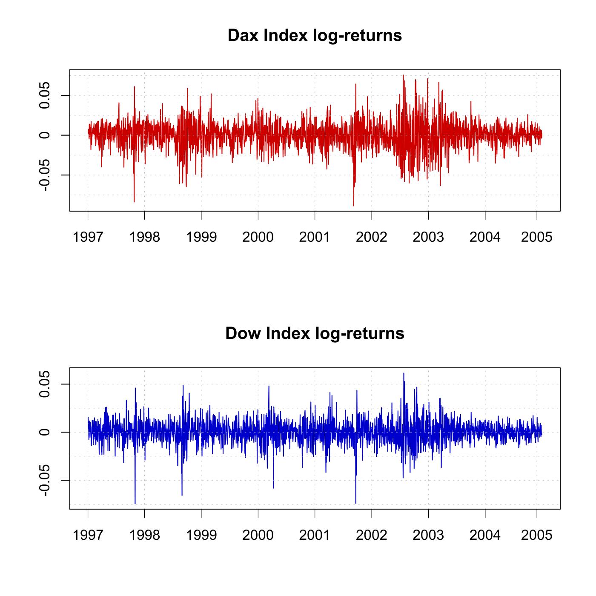
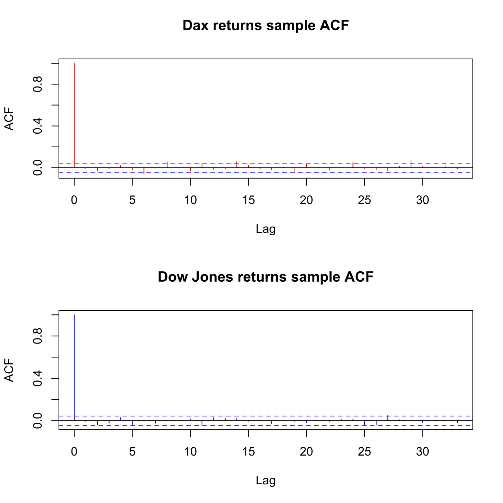
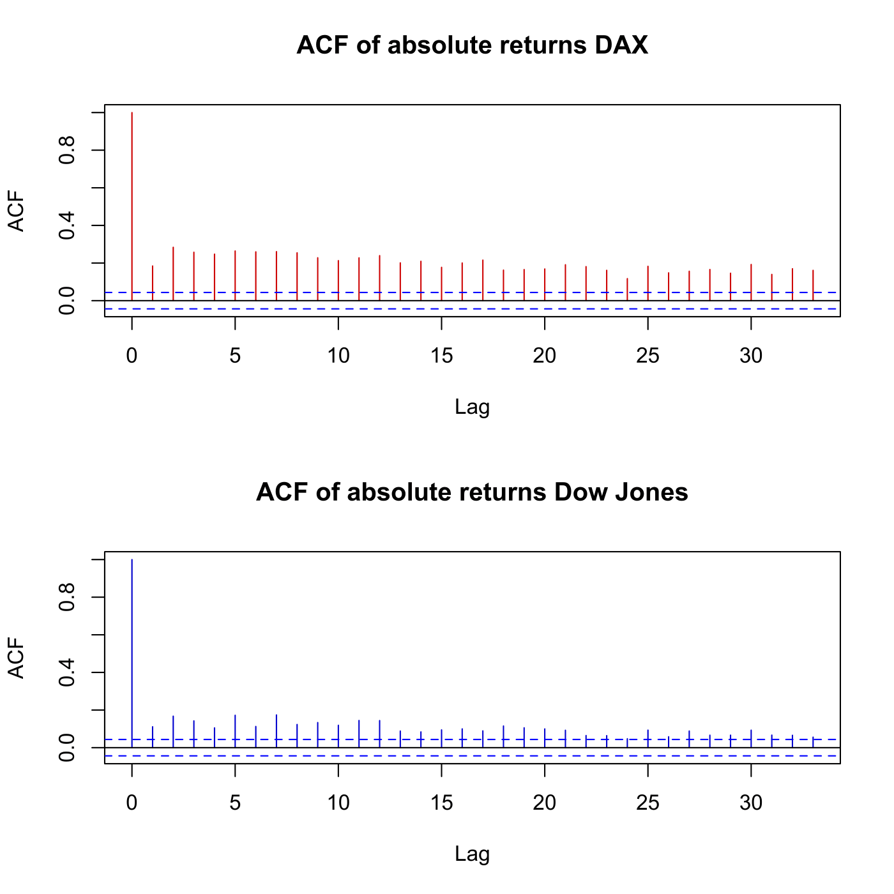
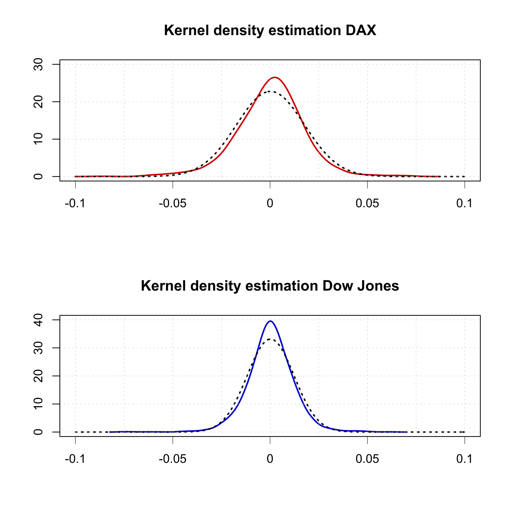

[](http://quantlet.de/)

## [](http://quantlet.de/) **SFStimeseries** [](http://quantlet.de/)

```yaml

Name of QuantLet : SFStimeseries

Published in : SFS

Description : 'Performs an empirical analysis using the data on DAX and Dow Jones index from the
period from 1997 to 2004.'

Keywords : 'acf, data visualization, dax, density, dow-jones, estimation, financial, graphical
representation, index, kernel, log-returns, plot, returns, squared, time-series'

See also : SFSdaxdowkernel

Submitted : Mon, August 03 2015 by quantomas

Author : Szymon Borak, Wolfgang K. Härdle, Brenda López Cabrera

Datafiles : daxdow.txt

```














### R Code:
```r
# clear variables and close windows
rm(list = ls(all = TRUE))
graphics.off()

# install and load packages
libraries = c("moments", "KernSmooth")
lapply(libraries, function(x) if (!(x %in% installed.packages())) {
    install.packages(x)
})
lapply(libraries, library, quietly = TRUE, character.only = TRUE)

# Load dataset
daxdow = read.table("daxdow.txt")

dax = daxdow[, 1]
dow = daxdow[, 2]

# Compute differences/returns daxret = price2ret(dax,[],'Periodic'); dowret = price2ret(dow,[],'Periodic');

daxret = c(diff(dax))
dowret = c(diff(dow))

# Log-returns
daxretlog = c(diff(log(dax)))
dowretlog = c(diff(log(dow)))

# Absolute log-returns
daxretlogabs = abs(daxretlog)
dowretlogabs = abs(dowretlog)

# Plot DAX / Dow absolute values
par(mfrow = c(2, 1))

plot(dax, col = "red3", type = "l", main = "Dax Index", ylab = "", xlab = "", xlim = c(0, 
    2023), ylim = c(min(dax), max(dax)), axes = FALSE, frame = TRUE)
axis(side = 2, at = seq(0, 10000, by = 1000), label = seq(0, 10000, by = 1000), lwd = 1)
axis(side = 1, at = c(0, 252, 505, 758, 1011, 1264, 1517, 1770, 2000), label = c("1997", 
    "1998", "1999", "2000", "2001", "2002", "2003", "2004", "2005"), lwd = 0.5)
abline(h = seq(0, 10000, by = 1000), lty = "dotted", lwd = 0.5, col = "grey")
abline(v = c(0, 252, 505, 758, 1011, 1264, 1517, 1770, 2000), lty = "dotted", lwd = 0.5, 
    col = "grey")

plot(dow, col = "blue3", type = "l", main = "Dow Index", ylab = "", xlab = "", xlim = c(0, 
    2023), ylim = c(min(dow), max(dow)), axes = FALSE, frame = TRUE)
axis(side = 2, at = seq(0, 13000, by = 1000), label = seq(0, 13000, by = 1000), lwd = 1)
axis(side = 1, at = c(0, 252, 505, 758, 1011, 1264, 1517, 1770, 2000), label = c("1997", 
    "1998", "1999", "2000", "2001", "2002", "2003", "2004", "2005"), lwd = 0.5)
abline(h = seq(0, 13000, by = 1000), lty = "dotted", lwd = 0.5, col = "grey")
abline(v = c(0, 252, 505, 758, 1011, 1264, 1517, 1770, 2000), lty = "dotted", lwd = 0.5, 
    col = "grey")

# Plot DAX / Dow returns
dev.new()
par(mfrow = c(2, 1))

plot(daxret, col = "red3", type = "l", main = "Dax Index returns", ylab = "", xlab = "", 
    xlim = c(0, 2023), ylim = c(min(daxret), max(daxret)), axes = FALSE, frame = TRUE)
axis(side = 2, at = seq(-400, 400, by = 200), label = seq(-400, 400, by = 200), lwd = 1)
axis(side = 1, at = c(0, 252, 505, 758, 1011, 1264, 1517, 1770, 2000), label = c("1997", 
    "1998", "1999", "2000", "2001", "2002", "2003", "2004", "2005"), lwd = 0.5)
abline(h = seq(-400, 400, by = 100), lty = "dotted", lwd = 0.5, col = "grey")
abline(v = c(0, 252, 505, 758, 1011, 1264, 1517, 1770, 2000), lty = "dotted", lwd = 0.5, 
    col = "grey")

plot(dowret, col = "blue3", type = "l", main = "Dow Index returns", ylab = "", xlab = "", 
    xlim = c(0, 2023), ylim = c(min(dowret), max(dowret)), axes = FALSE, frame = TRUE)
axis(side = 2, at = seq(-600, 400, by = 200), label = seq(-600, 400, by = 200), lwd = 1)
axis(side = 1, at = c(0, 252, 505, 758, 1011, 1264, 1517, 1770, 2000), label = c("1997", 
    "1998", "1999", "2000", "2001", "2002", "2003", "2004", "2005"), lwd = 0.5)
abline(h = seq(-600, 400, by = 200), lty = "dotted", lwd = 0.5, col = "grey")
abline(v = c(0, 252, 505, 758, 1011, 1264, 1517, 1770, 2000), lty = "dotted", lwd = 0.5, 
    col = "grey")

# Plot DAX / Dow log-returns
dev.new()
par(mfrow = c(2, 1))

plot(daxretlog, col = "red3", type = "l", main = "Dax Index log-returns", ylab = "", 
    xlab = "", xlim = c(0, 2023), ylim = c(min(daxretlog), max(daxretlog)), axes = FALSE, 
    frame = TRUE)
axis(side = 2, at = seq(-0.1, 0.1, by = 0.05), label = seq(-0.1, 0.1, by = 0.05), 
    lwd = 1)
axis(side = 1, at = c(0, 252, 505, 758, 1011, 1264, 1517, 1770, 2000), label = c("1997", 
    "1998", "1999", "2000", "2001", "2002", "2003", "2004", "2005"), lwd = 0.5)
abline(h = seq(-0.1, 0.1, by = 0.025), lty = "dotted", lwd = 0.5, col = "grey")
abline(v = c(0, 252, 505, 758, 1011, 1264, 1517, 1770, 2000), lty = "dotted", lwd = 0.5, 
    col = "grey")

plot(dowretlog, col = "blue3", type = "l", main = "Dow Index log-returns", ylab = "", 
    xlab = "", xlim = c(0, 2023), ylim = c(min(dowretlog), max(dowretlog)), axes = FALSE, 
    frame = TRUE)
axis(side = 2, at = seq(-0.1, 0.1, by = 0.05), label = seq(-0.1, 0.1, by = 0.05), 
    lwd = 1)
axis(side = 1, at = c(0, 252, 505, 758, 1011, 1264, 1517, 1770, 2000), label = c("1997", 
    "1998", "1999", "2000", "2001", "2002", "2003", "2004", "2005"), lwd = 0.5)
abline(h = seq(-0.1, 0.1, by = 0.025), lty = "dotted", lwd = 0.5, col = "grey")
abline(v = c(0, 252, 505, 758, 1011, 1264, 1517, 1770, 2000), lty = "dotted", lwd = 0.5, 
    col = "grey")

# Plot DAX / Dow sample ACF for log-returns
dev.new()
par(mfrow = c(2, 1))
e3_dax = acf(daxretlog, main = "Dax returns sample ACF", col = "red3")
e3_dow = acf(dowretlog, main = "Dow Jones returns sample ACF", col = "blue3")

# Plot DAX / Dow ACF of absolute log-return
dev.new()
par(mfrow = c(2, 1))
e1_dax = acf(daxretlogabs, main = "ACF of absolute returns DAX", col = "red3")
e1_dow = acf(dowretlogabs, main = "ACF of absolute returns Dow Jones", col = "blue3")

# Plot DAX / Dow ACF of squared log-return
dev.new()
par(mfrow = c(2, 1))
e2_dax = acf(daxretlog^2, main = "ACF of squared returns DAX", col = "red3")
e2_dow = acf(dowretlog^2, main = "ACF of squared returns Dow Jones", col = "blue3")

# Kernel Density Estimation DAX
f1    = daxretlog
fdax  = bkde(daxretlog, kernel = "biweight")  #Compute kernel density estimate
par(mfrow = c(2, 1))
plot(fdax, type = "l", lwd = 2, col = "red3", ylab = "", xlab = "", axes = FALSE, 
    frame = TRUE, xlim = c(-0.1, 0.1), ylim = c(0, 30), main = "Kernel density estimation DAX")
f2    = daxretlog
range = seq(-0.1, 0.1, by = 0.001)
m     = mean(f2)
sdd   = sd(c(f2))
lines(range, dnorm(range, m, sdd), lty = "dotted", lwd = 2, col = "grey3")

abline(h = seq(0, 40, by = 10), lty = "dotted", lwd = 0.5, col = "grey")
abline(v = seq(-0.1, 0.1, 0.025), lty = "dotted", lwd = 0.5, col = "grey")
axis(side = 2, at = seq(0, 40, by = 10), label = seq(0, 40, by = 10), lwd = 1)
axis(side = 1, at = seq(-0.1, 0.1, 0.05), label = seq(-0.1, 0.1, 0.05), lwd = 0.5)

# Kernel Density Estimation Dow
fdow  = bkde(dowretlog, kernel = "biweight")  #Compute kernel density estimate
plot(fdow, type = "l", lwd = 2, col = "blue3", ylab = "", xlab = "", axes = FALSE, 
    frame = TRUE, xlim = c(-0.1, 0.1), ylim = c(0, 40), main = "Kernel density estimation Dow Jones")
f3    = dowretlog
range = seq(-0.1, 0.1, by = 0.001)
m     = mean(f3)
sdd   = sd(c(f3))
lines(range, dnorm(range, m, sdd), lty = "dotted", lwd = 2, col = "grey3")

abline(h = seq(0, 40, by = 10), lty = "dotted", lwd = 0.5, col = "grey")
abline(v = seq(-0.1, 0.1, 0.025), lty = "dotted", lwd = 0.5, col = "grey")
axis(side = 2, at = seq(0, 40, by = 10), label = seq(0, 40, by = 10), lwd = 1)
axis(side = 1, at = seq(-0.1, 0.1, 0.05), label = seq(-0.1, 0.1, 0.05), lwd = 0.5)

# Compute the ACF for DAX absolute log-returns, squared returns and log-returns with 95% confidence interval.
e1_dax = acf(daxretlogabs, plot = FALSE)
e2_dax = acf(daxretlog^2, plot = FALSE)
e3_dax = acf(daxretlog, plot = FALSE)
e4_dax = mean(daxretlog, plot = FALSE)

# Compute the ACF for Dow Jones absolute log-returns, squared returns and log-returns with 95% confidence interval.
e1_dow = acf(dowretlogabs, plot = FALSE)
e2_dow = acf(dowretlog^2, plot = FALSE)
e3_dow = acf(dowretlog, plot = FALSE)
e4_dow = mean(dowretlog, plot = FALSE)

E_Dax = c(e4_dax, skewness(daxretlog), kurtosis(daxretlog), c(e3_dax[2]$acf), c(e2_dax[2]$acf), 
    c(e1_dax[2]$acf))
E_Dow = c(e4_dow, skewness(dowretlog), kurtosis(dowretlog), c(e3_dow[2]$acf), c(e2_dow[2]$acf), 
    c(e1_dow[2]$acf))

# Display the mean, skewness, kurtosis, autocorrelation for log-returns, squarred log-returns and absolute returns for the DAX and Dow Jones index.
print("DAX")
print("    Mean      Skewness       Kurtosis       ACF r_t      ACF r_t^2      ACF abs(r_t)")
print(E_Dax)
print(" ")
print("Dow Jones Industrial Average")
print("    Mean      Skewness       Kurtosis       ACF r_t      ACF r_t^2      ACF abs(r_t)")
print(E_Dow) 

```
