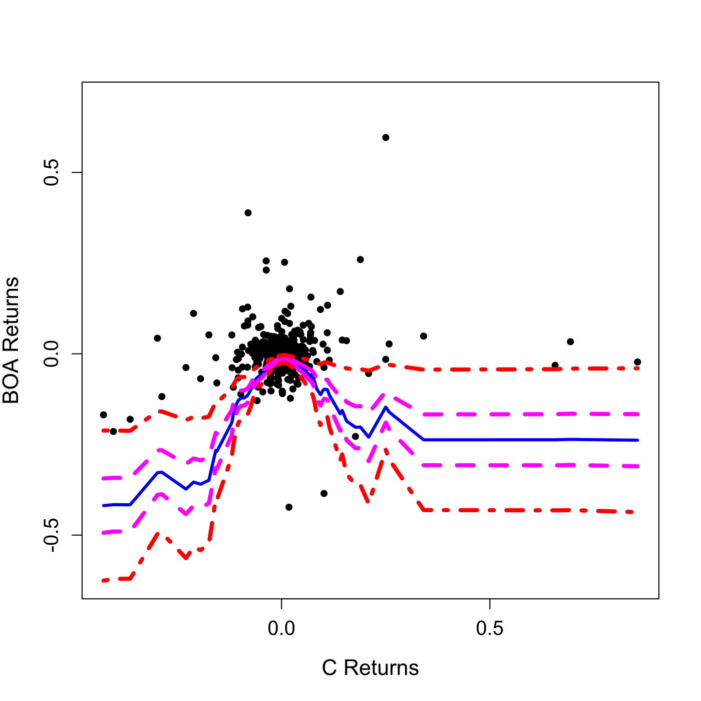

[](http://quantlet.de/)

## [](http://quantlet.de/) **SFSbootband** [](http://quantlet.de/)

```yaml

Name of QuantLet : SFSbootband

Published in : SFS

Description : 'Compares the asymptotic and bootstrapped confidence band of the conditional quantile
curve for Bank of America and Citigroup weekly returns.'

Keywords : 'asset, asymptotic, bootstrap, confidence-bands, data visualization, estimation,
extreme-value, financial, graphical representation, kernel, normal, plot, price, quantile,
regression, returns, time-series, visualization'

See also : TXTSimulation, TXTSimulationAttention, TXTSimulationBS

Author : Shih-Kang Chao

Submitted : Mon, August 03 2015 by quantomas

Datafiles : boa.csv, citi.csv

Input: 
- q: quantile between 0 and 1
- alpha: 1-confidence level
- n: number of observations

Example : The example is produced for the values q=0.05, alpha=0.95, n=546.

```




### R Code:
```r
# clear variables and close windows
rm(list = ls(all = TRUE))
graphics.off()

# install and load packages
libraries = c("quantreg", "KernSmooth", "foreign")
lapply(libraries, function(x) if (!(x %in% installed.packages())) {
    install.packages(x)
})
lapply(libraries, library, quietly = TRUE, character.only = TRUE)

# Main computation
N          = 546  		# 260 weekly values = 5 years (52 weeks per year)
seuil      = 0  		# starting value 
boa        = read.table("boa.csv")
citi       = read.table("citi.csv")
citi_trunc = numeric(0)
boa_trunc  = numeric(0)
for (i in 1:N) {
    boa_trunc[i] = boa[(length(boa[, 1]) - N - seuil + i), 1]
}
for (i in 1:N) {
    citi_trunc[i] = citi[length(citi[, 1]) - N - seuil + i, 1]
}
q1         = numeric(0)
q1band     = numeric(0)
q2         = numeric(0)
q2band     = numeric(0)

VAR1_trunc = numeric(0)
VAR1_trunc = c(1:N)/N
VAR2_trunc = numeric(0)
VAR2_trunc = boa_trunc[order(citi_trunc)]

f = approxfun(density(citi_trunc)$x, density(citi_trunc)$y, method = "linear")

n     = 546  	# number of observations
gridn = n
q     = 0.05
alpha = 0.05  # (1-alpha)*100% significance level for CI
bound = c(min(VAR2_trunc), max(VAR2_trunc))
yuv   = sort(VAR1_trunc)  # just sort them for later use # regressor
yur   = VAR2_trunc[order(VAR1_trunc)]  # regressand

# calculate the optimal bandwith qrh which is based on the optimal bandwidth from mean regression, as in yu and jones 1998
h2    = dpill(yuv, yur, gridsize = gridn)

# chooce a bit lager bandwidth here, e.g. 1.5qrh or 2qrh
qrh2  = 2 * h2 * ((q * (1 - q)/(dnorm(qnorm(p = q))^2))^(1/5))

fit2bis = lprq(VAR1_trunc, VAR2_trunc, h = qrh2, m = n, tau = q)

# Asymptotic confidence band
cc     = 1/4  # this is for normal kernel, if quartic kernel, value is  3/2   
lambda = 1/2/sqrt(pi)  # this is for normal kernel, if quartic kernel, value is    5/7
delta  = -log(qrh2)/log(n)
dd     = sqrt(2 * delta * log(n)) + (2 * delta * log(n))^(-1/2) * log(cc/2/pi)
h12    = (0.5 * (1 - 0.5)/dnorm(qnorm(0.5))^2)^0.2 * 2.42 * sd(yuv) * n^(-0.2)
if (h12 < 1) {
    b2 	= 10 * max(h12^5/((q * (1 - q)/dnorm(qnorm(q))^2)^0.2 * 2.42 * sd(yuv) * n^(-0.2))^3, 
        (q * (1 - q)/dnorm(qnorm(q))^2)^0.2 * 2.42 * sd(yuv) * n^(-0.2)/10)
} else b2 = 10 * h12^4/((q * (1 - q)/dnorm(qnorm(q))^2)^0.2 * 2.42 * sd(yuv) * n^(-0.2))^3

# empirical pdf of x
fxd = bkde(yuv, gridsize = gridn, range.x = c(fit2bis$xx[1], fit2bis$xx[gridn]), 
    truncate = TRUE)

# estimate 'conditional pdf f(y|x)=f12bis' at the quantile point for the 100 grid points
fl2bis 	= vector(length = gridn, mode = "numeric")
kernelq = function(u) {
    dnorm(u, mean = 0, sd = 1)
}  # or, quadratic kernel:    ){(15/16)*((1-u^2)^2)*(-1 <= u)*(u <= 1)}
for (k in 1:gridn) {
    fl2bis[k] = sum((kernelq((yuv - fit2bis$xx[k])/qrh2) * kernelq((yur - fit2bis$fv[k])/b2)/qrh2/b2))/sum(kernelq((yuv - 
        fit2bis$xx[k])/qrh2)/qrh2)
}
bandt2bis = (fxd$y)^(1/2) * fl2bis
cn        = log(2) - log(abs(log(1 - alpha)))
band2bis  = (n * qrh2)^(-1/2) * sqrt(lambda * q * (1 - q)) * bandt2bis^(-1) * (dd + 
    cn * (2 * delta * log(n))^(-1/2))
qrh2
q1        = fit2bis$fv
q1band    = band2bis

B = 500
# modified from lprq, s.t. we can specify where to estimate quantiles
"lprq2" = function(x, y, h, tau, x0) {
    xx = x0
    fv = xx
    dv = xx
    for (i in 1:length(xx)) {
        z     = x - xx[i]
        wx    = dnorm(z/h)
        r     = rq(y ~ z, weights = wx, tau = tau, ci = FALSE)
        fv[i] = r$coef[1]
        dv[i] = r$coef[2]
    }
    list(xx = xx, fv = fv, dv = dv)
}
# modified from lprq, s.t. we can specify where to estimate quantiles, but 'random quantiles'
"lprq3" = function(x, y, h, x0) {
    xx = x0
    fv = xx
    dv = xx
    for (i in 1:length(xx)) {
        z     = x - xx[i]
        wx    = dnorm(z/h)
        r     = rq(y ~ z, weights = wx, tau = runif(1), ci = FALSE)  # 'random quantiles' is seen at tau=runif(1)
        fv[i] = r$coef[1]
        dv[i] = r$coef[2]
    }
    list(xx = xx, fv = fv, dv = dv)
}

fitover = lprq2(yuv, yur, h = qrh2 * n^(4/45), tau = q, x0 = yuv)
d 		= vector(length = B, mode = "numeric")  # initilize the bootstrap maximum e = vector(length= B, mode='numeric')
for (jj in 1:B) {
    fiterror = lprq3(yuv, (yur - fit2bis$fv), h = qrh2, x0 = yuv)
    ystar    = fitover$fv + fiterror$fv
    fitstar  = lprq(yuv, ystar, h = qrh2, tau = q, m = gridn)  
    d[jj]    = max(abs(bandt2bis * (fitstar$fv - fitover$fv)))
    print(jj)
}
dstar = quantile(d, probs = 1 - alpha)
dstar = dstar * bandt2bis^(-1)

# Plots
plot(citi_trunc, boa_trunc, pch = 20, cex = 1.2, xlab = "C Returns", ylab = "BOA Returns", 
    cex.axis = 1.2, cex.lab = 1.3, lab = c(3, 3, 0), ylim = c(min(VAR2_trunc) - 0.2, 
        max(VAR2_trunc) + 0.1), main = "")  #Returns scatter plot and Quantile Function
lines(sort(citi_trunc), q1/sqrt(f(sort(citi_trunc))), col = "blue2", lwd = 3)
lines(sort(citi_trunc), (q1 - q1band)/sqrt(f(sort(citi_trunc))), col = "magenta", 
    lty = 2, lwd = 4)
lines(sort(citi_trunc), (q1 + q1band)/sqrt(f(sort(citi_trunc))), col = "magenta", 
    lty = 2, lwd = 4)
lines(sort(citi_trunc), (q1 + dstar)/sqrt(f(sort(citi_trunc))), col = "red", lty = 4, 
    lwd = 4)
lines(sort(citi_trunc), (q1 - dstar)/sqrt(f(sort(citi_trunc))), col = "red", lty = 4, 
    lwd = 4)
 

```
