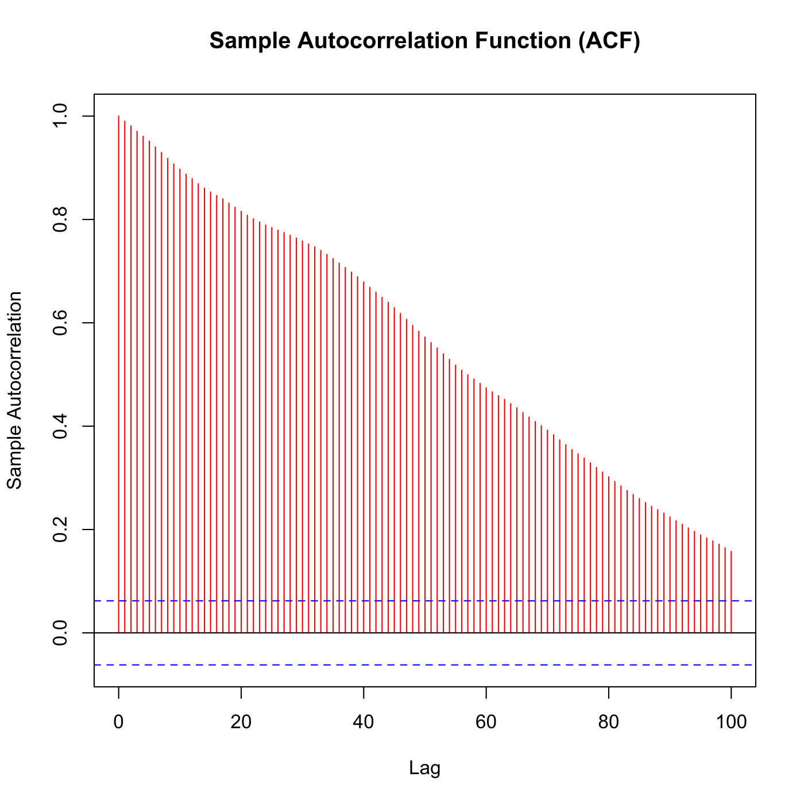

[](http://quantlet.de/)

## [](http://quantlet.de/) **SFScola2** [](http://quantlet.de/)

```yaml

Name of QuantLet : SFScola2

Published in : SFS

Description : 'Plots the autocorrelation function of daily stock prices for Coca-Cola company from
1 January 2002 to 30 November 2004.'

Keywords : 'acf, asset, autocorrelation, data visualization, financial, graphical representation,
plot, price, stock-price, time-series, visualization'

See also : SFScola1, SFScola3

Author : Szymon Borak, Wolfgang K. Härdle, Brenda López Cabrera

Submitted : Mon, August 03 2015 by quantomas

Datafile : Coca_cola.txt

```




### R Code:
```r
# clear variables and close windows
rm(list = ls(all = TRUE))
graphics.off()

x = read.table("Coca_cola.txt")     # Stock prices
x = ts(x)                           # transform into time series object

autocorr = acf(x, lag.max = 100, col = "red", main = "Sample Autocorrelation Function (ACF)", 
    ylab = "Sample Autocorrelation") 

```
