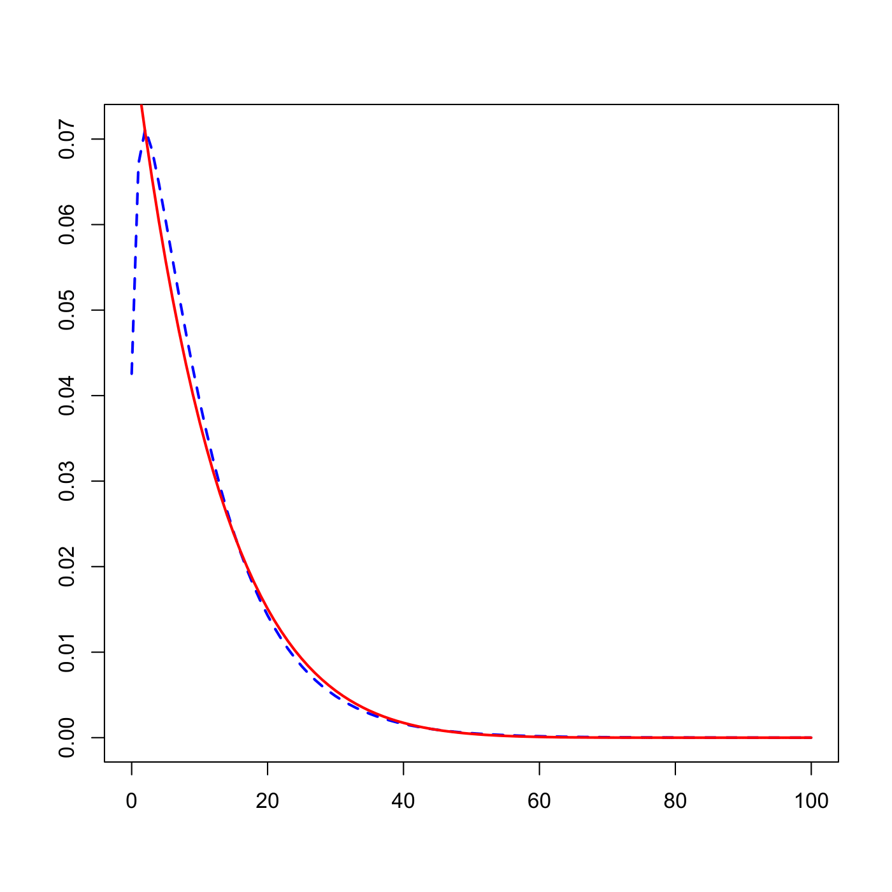
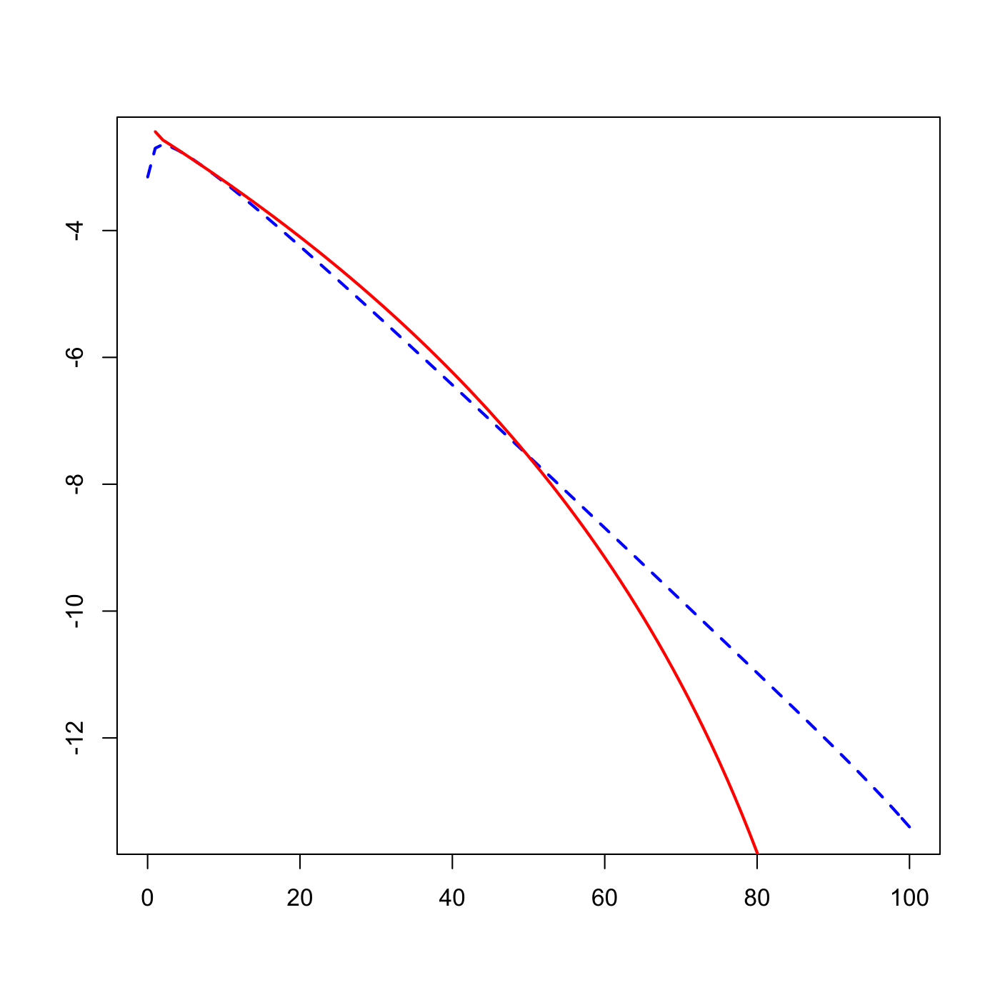

[](http://quantlet.de/)

## [](http://quantlet.de/) **SFSLossBernPois** [](http://quantlet.de/)

```yaml

Name of QuantLet : SFSLossBernPois

Published in : SFS

Description : 'Plots loss distributions in linear and semi-log scale in the simplified Bernoulli
model (red line) and simplified Poisson model (blue line).'

Keywords : 'bernoulli, density, distribution, graphical representation, linear, loss-distribution,
model, plot, poisson, probability, scale'

See also : SFSLossBern, SFSLossBern

Author : Lasse Groth

Submitted : Mon, August 03 2015 by quantomas

Example: 
- 1: 'The example is produced for the 100 obligors, Bernoulli parameters (1,9) and Poisson
parameters (1.25,0.08), linear scale.'
- 2: 'The example is produced for the 100 obligors, Bernoulli parameters (1,9) and Poisson
parameters (1.25,0.08), semi-log scale.'

```






### R Code:
```r
# Close all plots and clear variables
graphics.off()
rm(list = ls(all = TRUE))

aB = 1              # alpha - Bernoulli
bB = 9 * aB         # beta - Bernoulli

n = 100

EP = aB/(aB + bB)   # Expected value of loss probability - Bernoulli
VP = aB * bB/((aB + bB) * (aB + bB) * (aB + bB + 1))    # Variance of loss probability - Bernoulli

bP = ((n - 1) * VP - EP * EP)/(EP * n)                  # beta  - Poisson
aP = EP/bP                                              # alpha - Poisson

VL1 = n * (n - 1) * VP + n * EP * (1 - EP)  # Variance of cumulative loss probability - Bernoulli
VL2 = n * n * aP * bP * bP + n * EP         # Variance of cumulative loss probability - Poisson

print("Variance of Cumulative Loss Probability")
print("Bernoulli Poisson")
print(c(VL1, VL2))

CORB = VP/(EP * (1 - EP))                   # Correlation - Bernoulli
CORP = aP * bP * bP/(aP * bP * bP + EP)     # Correlation - Poisson

print("Default Correlation")
print("Bernoulli  Poisson")
print(c(CORB, CORP))

# Poisson pdf
h   = 0.01
lam = seq(0, 1, h)
m   = 100
k   = seq(0, m, 1)
L1  = matrix(0, 1, m + 1)
fp1 = dgamma(lam, aP, bP^(-1))

# Density for the Cumulative Loss Distribution in the Poisson model
for (i in 1:(m + 1)) {
    L1[i] = sum(dpois(k[i], m * lam) * fp1 * h)
}
plot(k, L1, type = "l", col = "blue", lwd = 2, xlab = "", ylab = "", lty = 2)

# Bernoulli pdf
h   = 0.001
p   = seq(0, 0.99, h)
m   = 100
k   = seq(0, m, 1)
L2  = matrix(0, m + 1, 1)
fp2 = dbeta(p, aB, bB)

# Density for the Cumulative Loss Distribution in the Bernoulli model
for (i in 1:(m + 1)) {
    L2[i] = sum(dbinom(k[i], m, p) * fp2 * h)
}
lines(k, L2, col = "red", lwd = 2)

# improvements of the pictures
L1l = log(L1)
L2l = log(L2)

dev.new()
plot(k, L1l, type = "l", col = "blue", lwd = 2, lty = 2, xlab = "", ylab = "")
lines(L2l, col = "red", lwd = 2) 

```
