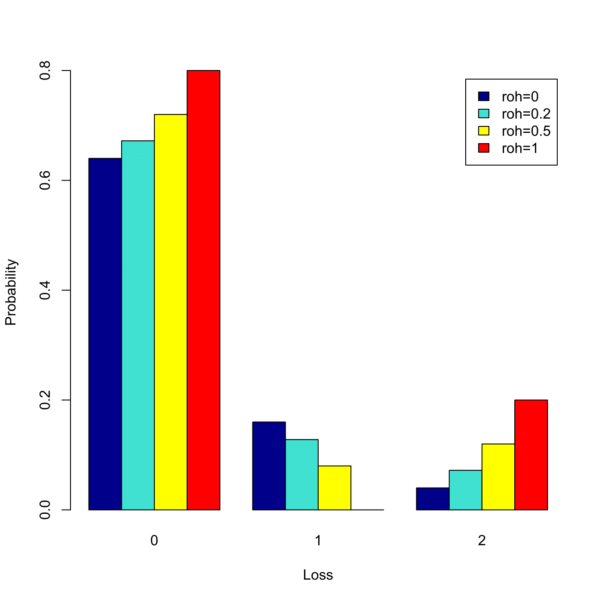

[](http://quantlet.de/)

## [](http://quantlet.de/) **SFSLossDiscrete** [](http://quantlet.de/)

```yaml

Name of QuantLet : SFSLossDiscrete

Published in : SFS

Description : Plots the loss distribution of portfolio of two zero coupon bonds with zero recovery.

Keywords : 'asset, bond, correlation, distribution, financial, graphical representation,
loss-distribution, plot, portfolio, simulation, zero-coupon'

Author : Lasse Groth

Submitted : Mon, August 03 2015 by quantomas

Input: 
- PD: probability of default
- RHO: correlation

Example : 'The example is produced for the values: PD = 0.2, RHO = [0,0.2,0.5,1].'

```




### R Code:
```r
# Close all plots and clear variables
graphics.off()
rm(list = ls(all = TRUE))

# Plots of correlation dependence in discrete case

L     = c(0, 1, 2)
PD    = 0.2
RHO   = c(0, 0.2, 0.5, 1)
PL012 = c()

for (i in 1:length(RHO)) {
    rho   = RHO[i]
    PL2   = rho * (1 - PD) * PD + PD^2
    PL1   = PD * (1 - PD) * (1 - rho)
    PL0   = (1 - PD) - PD * (1 - PD) * (1 - rho)
    PL012 = cbind(PL012, c(PL0, PL1, PL2))
}

barplot(height = t(PL012), beside = TRUE, names.arg = c(0, 1, 2), col = c("dark blue", 
    "turquoise ", "yellow", "red"), xlab = "Loss", ylab = "Probability", legend.text = c("roh=0", 
    "roh=0.2", "roh=0.5", "roh=1")) 

```
