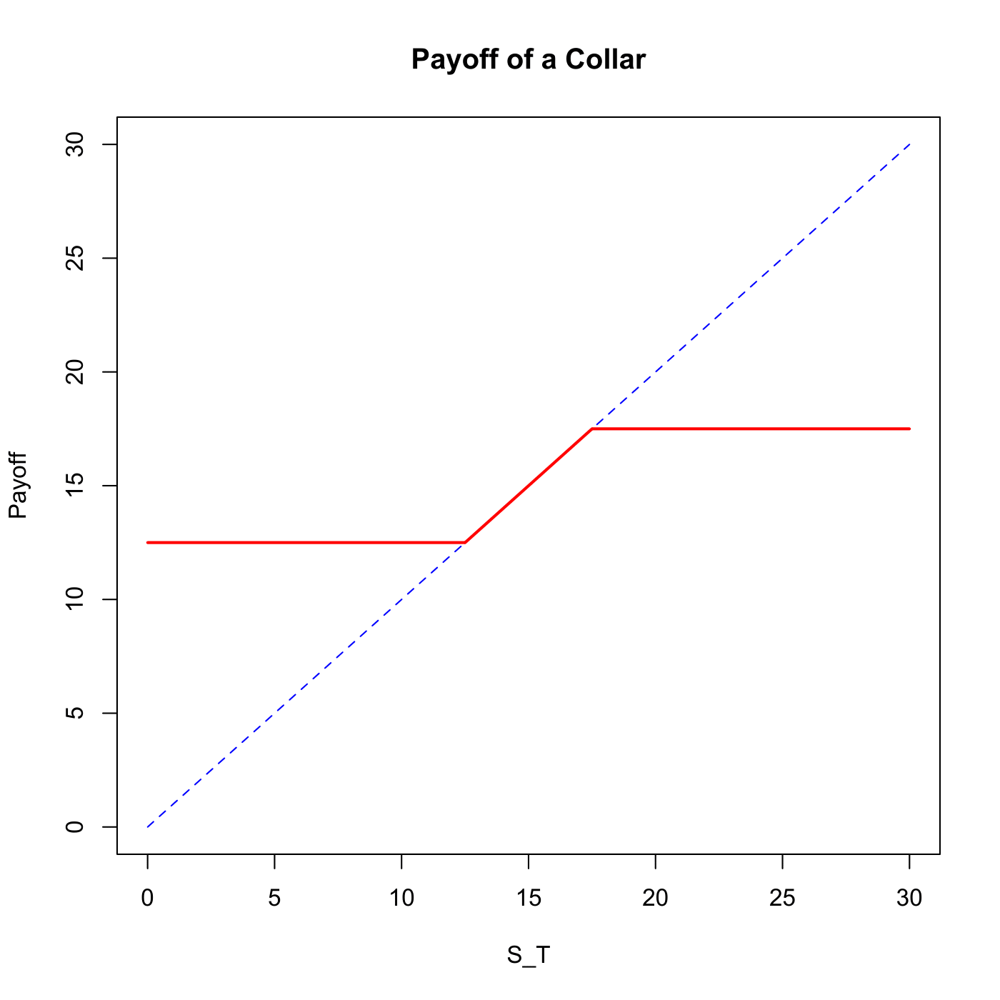

[](http://quantlet.de/)

## [](http://quantlet.de/) **SFSpayoffcollar** [](http://quantlet.de/)

```yaml

Name of QuantLet : SFSpayoffcollar

Published in : SFS

Description : Draws a payoff graph of a collar option strategy at the expiration date.

Keywords : 'call, european-option, financial, graphical representation, option, option-price, plot,
put, simulation, strategy'

See also : SFSstrap

Author : Lasse Groth

Submitted : Mon, August 03 2015 by quantomas

Input: 
- St: stock price
- Kp: strike price for long put
- Kc: strike price for short call

Example : 'The example is produced for the values: St=15, Kp=12.5, Kc=17.5.'

```




### R Code:
```r
collar = function(St, Kp, Kc) {
    plot(0:2 * St, 0:2 * St, type = "l", xlab = "S_T", ylab = "Payoff", col = "blue", 
        lty = 2)
    lines(c(0, Kp), c(Kp, Kp), col = "red", lwd = 2)
    lines(c(Kc, Kp), c(Kc, Kp), col = "red", lwd = 2)
    lines(c(Kc, 2 * St), c(Kc, Kc), col = "red", lwd = 2)
    title("Payoff of a Collar")
}

collar(15, 12.5, 17.5) 
```
