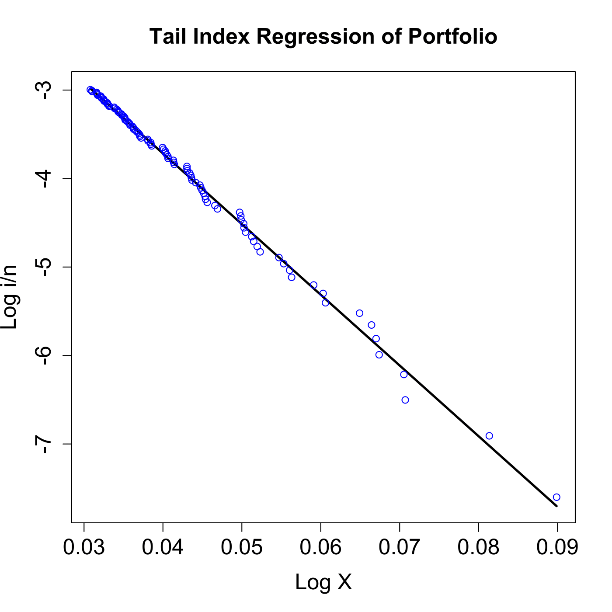

[](http://quantlet.de/)

## [](http://quantlet.de/) **SFStailport** [](http://quantlet.de/)

```yaml

Name of QuantLet : SFStailport

Published in : SFS

Description : 'Plots the right tail of the logarithmic empirical distribution of the portfolio
(Bayer, BMW, Siemens) negative log-returns from 1992-01-01 to 2006-09-21.'

Keywords : 'distribution, edf, empirical, extreme-value, financial, graphical representation,
least-squares, log-returns, logarithmic, plot, portfolio, regression, returns, tail'

See also : SFSvarblockmaxbacktesting, SFSvarpotbacktesting

Author : Lasse Groth

Submitted : Mon, August 03 2015 by quantomas

Datafiles : Bay9906_close_2kPoints.txt, Bmw9906_close_2kPoints.txt, Sie9906_close_2kPoints.txt

```




### R Code:
```r
# Close all plots and clear variables
graphics.off()
rm(list = ls(all = TRUE))

# Load data
a = read.table("Bay9906_close_2kPoints.txt")
b = read.table("Bmw9906_close_2kPoints.txt")
c = read.table("Sie9906_close_2kPoints.txt")

# Create the portfolio
d  = a + b + c  
lg = dim(d)
x  = log(d[-lg[1], ]) - log(d[-1, ])  # Negative log-returns

n = length(x)
x = sort(x, decreasing = TRUE)
m = 100

# Generalized least squares method
x     = x[1:m]
x1    = cbind(matrix(1, m, 1), x)
y1    = log(seq(1, m)/n)
g     = solve(t(x1) %*% x1) %*% (t(x1) %*% y1)
line  = g[1] + g[2] * x
alpha = -g[2]
gamma = 1/alpha
out   = cbind(x, line)

# Plot
plot(out[, 1], out[, 2], type = "l", xlab = ("Log X"), ylab = ("Log i/n"), lwd = 2.5, 
    cex.axis = 1.5, cex.lab = 1.5)
points(x, y1, col = "blue")
title("Tail Index Regression of Portfolio", cex.main = 1.5) 

```
