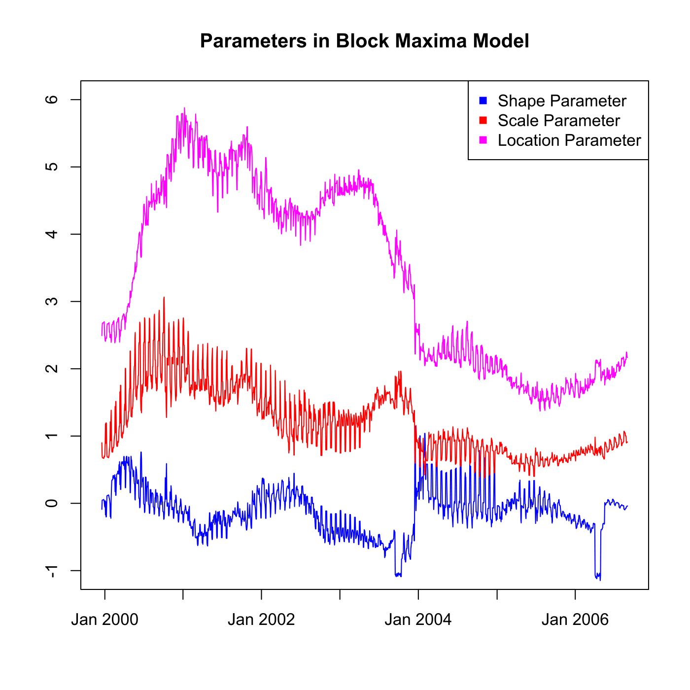

[](http://quantlet.de/)

## [](http://quantlet.de/) **SFSvar_block_max_params** [](http://quantlet.de/)

```yaml

Name of QuantLet : SFSvar_block_max_params

Published in : SFS

Description : 'Provides and plots shape, scale and location parameters estimated for calculating
Value-at-Risk (VaR) with Block Maxima Model.'

Keywords : 'VaR, block-maxima, data visualization, estimation, forecast, graphical representation,
model, parameter, plot, portfolio, scale, time-series'

See also : SFSvar_pot_params, SFSvar_pot_params, SFSvarblockmaxbacktesting, SFSvarpotbacktesting

Author : Lasse Groth

Submitted : Mon, August 03 2015 by quantomas

Datafiles : alpha_bMax_Portf.txt, beta_bMax_Portf.txt, kappa_bMax_Portf.txt

Example : 'Parameters estimated in Block Maxima Model for portfolio: Bayer, BMW, Siemens. Time
period: from 1992-01-01 to 2006-09-01.'

```




### R Code:
```r
# Close all plots and clear variables
graphics.off()
rm(list = ls(all = TRUE))

# Load data
k = t(read.table("kappa_bMax_Portf.txt"))
a = t(read.table("alpha_bMax_Portf.txt"))
b = t(read.table("beta_bMax_Portf.txt"))

# Plots of shape, scale and location parameters
plot(k, type = "l", col = "blue", ylim = c(-1, 6), ylab = c(""), xlab = c(""), axes = FALSE)
lines(a, col = "red")
lines(b, col = "magenta")
title("Parameters in Block Maxima Model")
box()
axis(1, c(261, 521, 782, 1043, 1304, 1566, 1826) - 250, c("Jan 2000", "Jan 2001", 
    "Jan 2002", "Jan 2003", "Jan 2004", "Jan 2005", "Jan 2006"))
axis(2)

legend("topright", c("Shape Parameter", "Scale Parameter", "Location Parameter"), 
    pch = c(15, 15, 15), col = c("blue", "red", "magenta")) 
```
