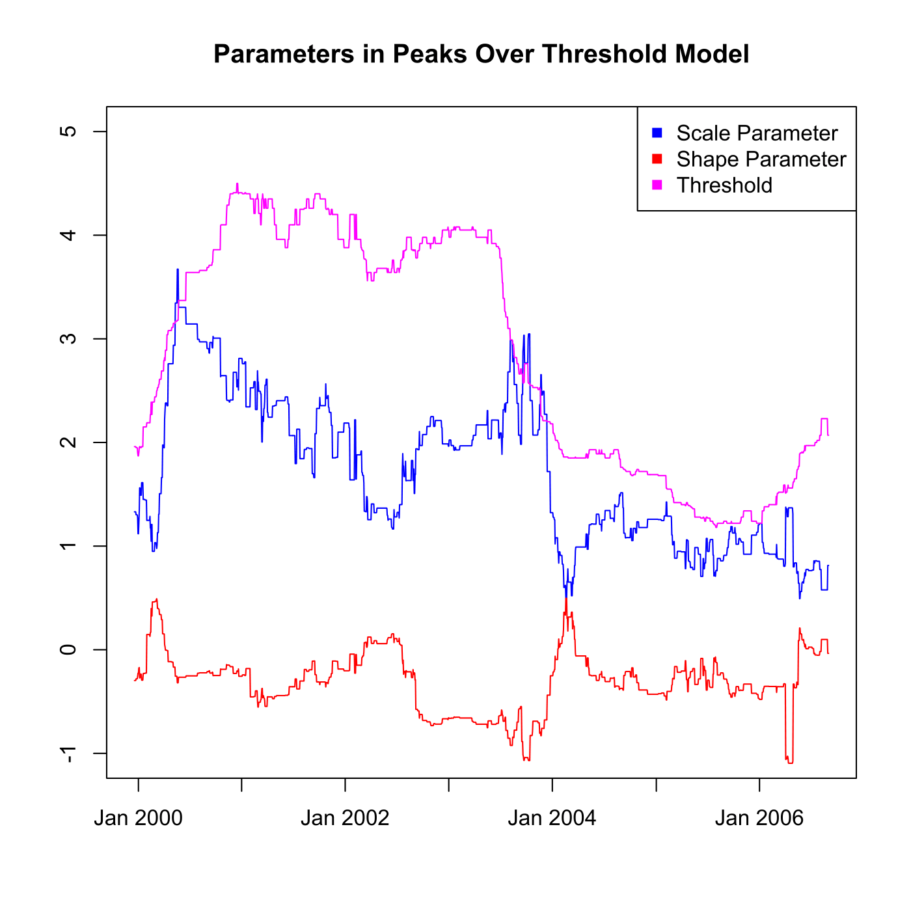

[](http://quantlet.de/)

## [](http://quantlet.de/) **SFSvar_pot_params** [](http://quantlet.de/)

```yaml

Name of QuantLet : SFSvar_pot_params

Published in : SFS

Description : 'Provides and plots threshold, shape and scale parameters estimated for calculating
Value-at-Risk (VaR) with Peaks Over Treshold model.'

Keywords : 'POT, VaR, data visualization, estimation, forecast, graphical representation, model,
parameter, plot, portfolio, scale, threshold, time-series, visualization'

See also : SFSvar_block_max_params, SFSvarblockmaxbacktesting, SFSvarpotbacktesting

Author : Lasse Groth

Submitted : Mon, August 03 2015 by quantomas

Datafiles : beta_pot_Portf.txt, ksi_pot_Portf.txt, u_pot_Portf.txt

Example : 'Parameters estimated in POT Model for portfolio: Bayer, BMW, Siemens. Time period: from
1992-01-01 to 2006-09-01.'

```




### R Code:
```r
# Close all plots and clear variables
graphics.off()
rm(list = ls(all = TRUE))

# Load data
bet = t(read.table("beta_pot_Portf.txt"))
ksi = t(read.table("ksi_pot_Portf.txt"))
u = t(read.table("u_pot_Portf.txt"))

# Plots of shape, scale and treshold parameters
plot(bet, type = "l", col = "blue", ylim = c(-1, 5), ylab = c(""), xlab = c(""), 
    axes = FALSE)
lines(ksi, col = "red")
lines(u, col = "magenta")
title("Parameters in Peaks Over Threshold Model")
box()
axis(1, c(261, 521, 782, 1043, 1304, 1566, 1826) - 250, c("Jan 2000", "Jan 2001", 
    "Jan 2002", "Jan 2003", "Jan 2004", "Jan 2005", "Jan 2006"))
axis(2)

legend("topright", c("Scale Parameter", "Shape Parameter", "Threshold"), pch = c(15, 
    15, 15), col = c("blue", "red", "magenta")) 
```
