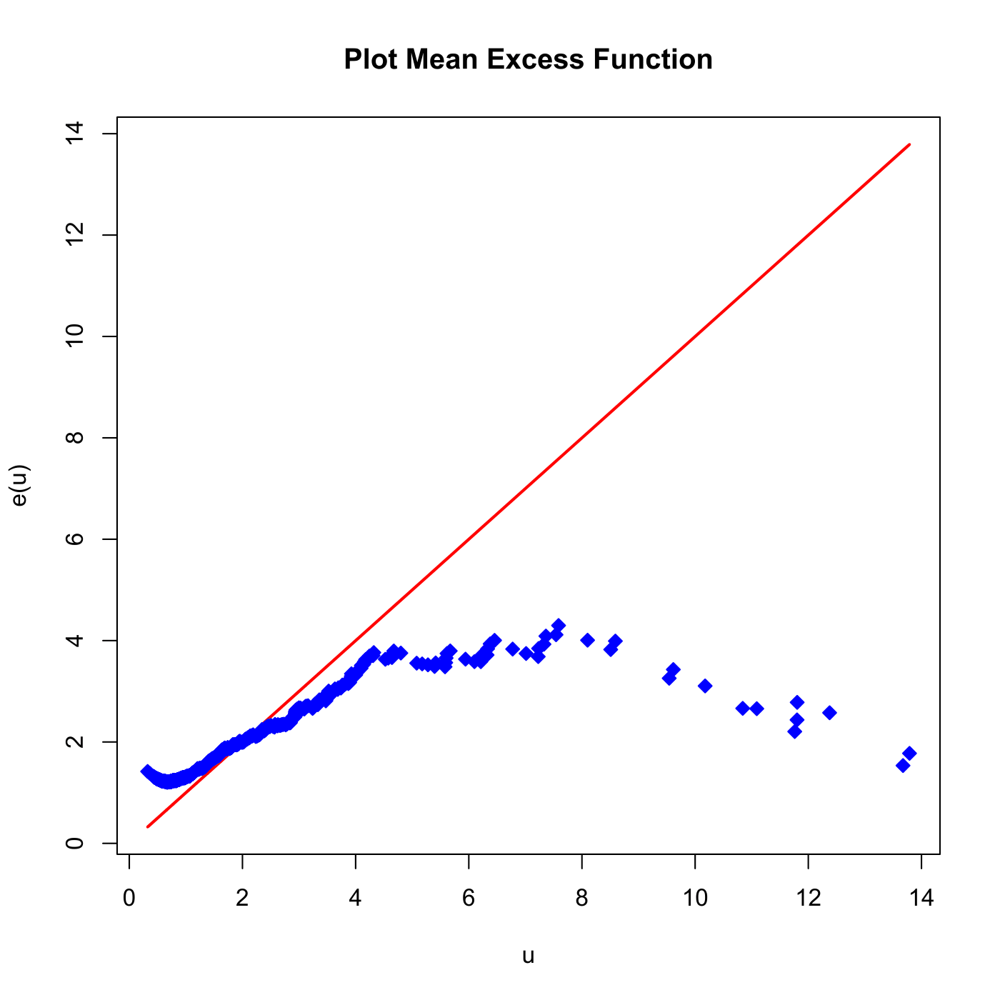

[](http://quantlet.de/)

## [](http://quantlet.de/) **SFSmeffrechet** [](http://quantlet.de/)

```yaml

Name of QuantLet : SFSmeffrechet

Published in : SFS

Description : 'Plots the theoretical (red) and empirical (blue) mean excess function of the Frechet
distribution with alpha = 2.'

Keywords : Frechet, MEF, distribution, empirical, graphical representation, plot, simulation

See also : SFSevt2

Author : Lasse Groth

Submitted : Wed, August 05 2015 by quantomas

```




### R Code:
```r
# clear variables and close windows
rm(list = ls(all = TRUE))
graphics.off()

# install and load packages
libraries = c("matlab")
lapply(libraries, function(x) if (!(x %in% installed.packages())) {install.packages(x)} )
lapply(libraries, library, quietly = TRUE, character.only = TRUE)

# Simulate Frechet Distribution
nsim = 1000
urv  = runif(nsim, min = 0, max = 1)
ones = matrix(1, nsim, 1)
rv   = ones/((-log(urv))^(1/(2 * ones)))

k    = 999

rv   = sort(rv, decreasing = TRUE)
MEF  = matrix(, , , )
t    = rv[1:k + 1]  # t must be >0

# Calculate the empirical mean excess function
for (i in 1:length(t)) {
    y = rv[rv > t[i]]
    MEF[i] = mean(y - t[i])
}

# Plot
plot(t[3:k + 1], t[3:k + 1], type = "l", col = "red", lwd = 2, xlab = c("u"), ylab = c("e(u)"))
points(t[3:k + 1], MEF[3:k + 1], col = "blue", pch = 23, bg = "blue")
title("Plot Mean Excess Function") 
```
