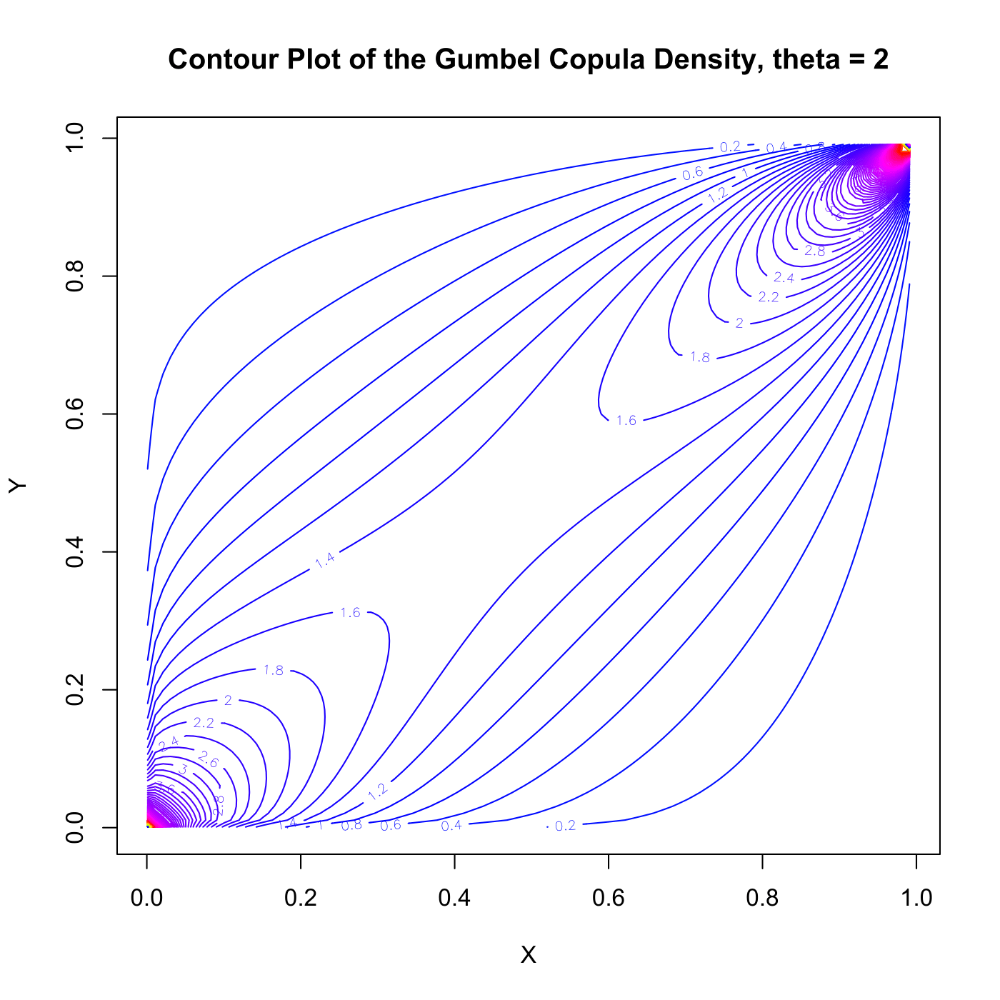

[](http://quantlet.de/)

## [](http://quantlet.de/) **SFScontourgumbel** [](http://quantlet.de/)

```yaml

Name of QuantLet : SFScontourgumbel

Published in : 'Statistics of Financial Markets : Exercises and Solutions'

Description : Produces a contour plot of the Gumbel copula density for theta=2.

Keywords : contour, copula, density, graphical representation, gumbel, joint distribution, plot

See also : SFEVaRHAC, SFEVaRcopulaSIM2ptv, SFEplotCop, SFEstaticCop

Author : Lasse Groth

Submitted : Wed, August 05 2015 by quantomas

Input: 
- p: theta

```




### R Code:
```r

# clear variables and close windows
rm(list = ls(all = TRUE))
graphics.off()

# install and load packages
libraries = c("matlab")
lapply(libraries, function(x) if (!(x %in% installed.packages())) {
    install.packages(x)
})
lapply(libraries, library, quietly = TRUE, character.only = TRUE)

# Create grid for plot
a = meshgrid(seq(0.001, 1, 0.01))
u = a[1]$x
v = a[2]$y
p = 2

# Calculate Copula
arg = (-log(u))^p + (-log(v))^p
gcopuly = exp(-arg^(1/p))/u/v * (log(u) * log(v))^(p - 1) * arg^(1/p - 2) * (p - 
    1 + arg^(1/p))

# Create Contour plot
contour(u[1, ], v[, 1], gcopuly, 150, col = rainbow(150, start = 0.65, end = 0.25), 
    xlab = c("X"), ylab = c("Y"))
title(paste("Contour Plot of the Gumbel Copula Density, theta =", p))
```
