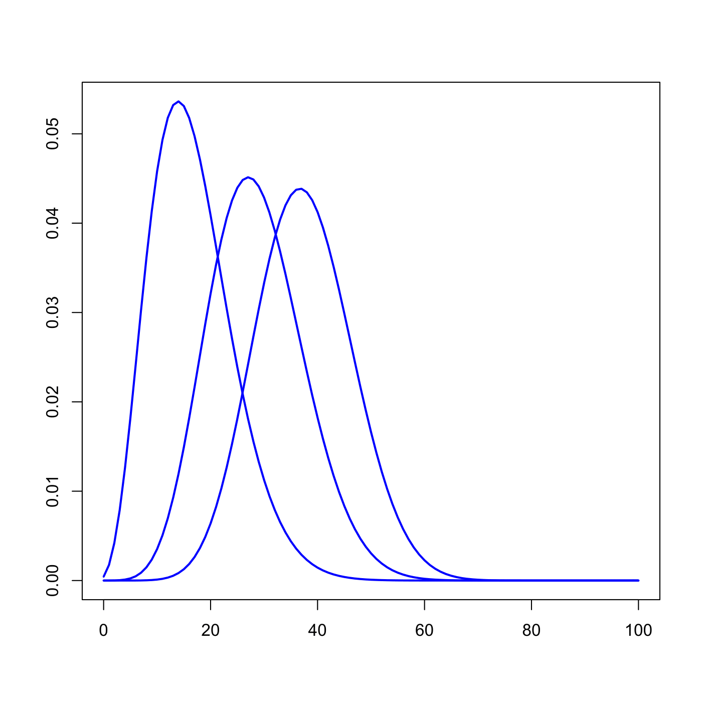
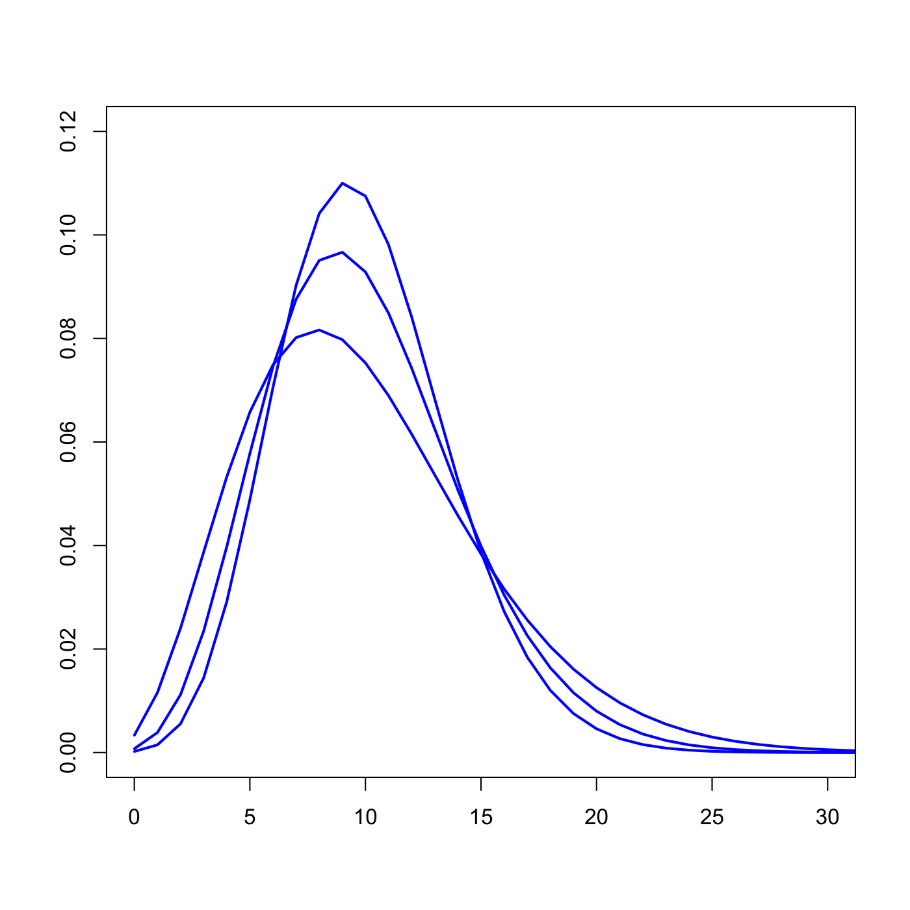

[](http://quantlet.de/)

## [](http://quantlet.de/) **SFSLossBern** [](http://quantlet.de/)

```yaml

Name of QuantLet : SFSLossBern

Published in : SFS

Description : 'Plots the loss distribution in the simplified Bernoulli model with default
probabilities coming from Beta distribution.'

Keywords : 'bernoulli, beta, default, density, distribution, graphical representation,
loss-distribution, model, plot, probability'

See also : SFSLossBernPois

Author : Lasse Groth

Submitted : Wed, August 05 2015 by quantomas

Example: 
- 1: 'The example is produced for the 100 obligors and Beta parameters: (5,25), (10,25), (15,25).'
- 2: 'The example is produced for the 100 obligors and Beta parameters: (5,45), (10,90), (20,180).'

```






### R Code:
```r
# Close all plots and clear variables
graphics.off()
rm(list = ls(all = TRUE))

# parameter settings
h   = 0.001
p   = seq(0, 0.99, h)
m   = 100
k   = seq(0, m, 1)
L1  = matrix(0, m + 1, 1)
L2  = L1
L3  = L1
L4  = L1
L5  = L1
L6  = L1

fp1 = dbeta(p, 5, 25)
fp2 = dbeta(p, 10, 25)
fp3 = dbeta(p, 15, 25)

for (i in 1:(m + 1)) {
    L1[i] = sum(dbinom(k[i], m, p) * fp1 * h)
    L2[i] = sum(dbinom(k[i], m, p) * fp2 * h)
    L3[i] = sum(dbinom(k[i], m, p) * fp3 * h)
}

plot(k, L1, type = "l", col = "blue", lwd = 2, xlab = "", ylab = "")
lines(k, L2, col = "blue", lwd = 2)
lines(k, L3, col = "blue", lwd = 2)

fp4 = dbeta(p, 5, 45)
fp5 = dbeta(p, 10, 90)
fp6 = dbeta(p, 20, 180)

for (i in 1:(m + 1)) {
    L4[i] = sum(dbinom(k[i], m, p) * fp4 * h)
    L5[i] = sum(dbinom(k[i], m, p) * fp5 * h)
    L6[i] = sum(dbinom(k[i], m, p) * fp6 * h)
}
dev.new()
plot(k, L4, type = "l", col = "blue", lwd = 2, xlim = c(0, 30), ylim = c(0, 0.12), 
    xlab = "", ylab = "")
lines(k, L5, col = "blue", lwd = 2)
lines(k, L6, col = "blue", lwd = 2) 

```
