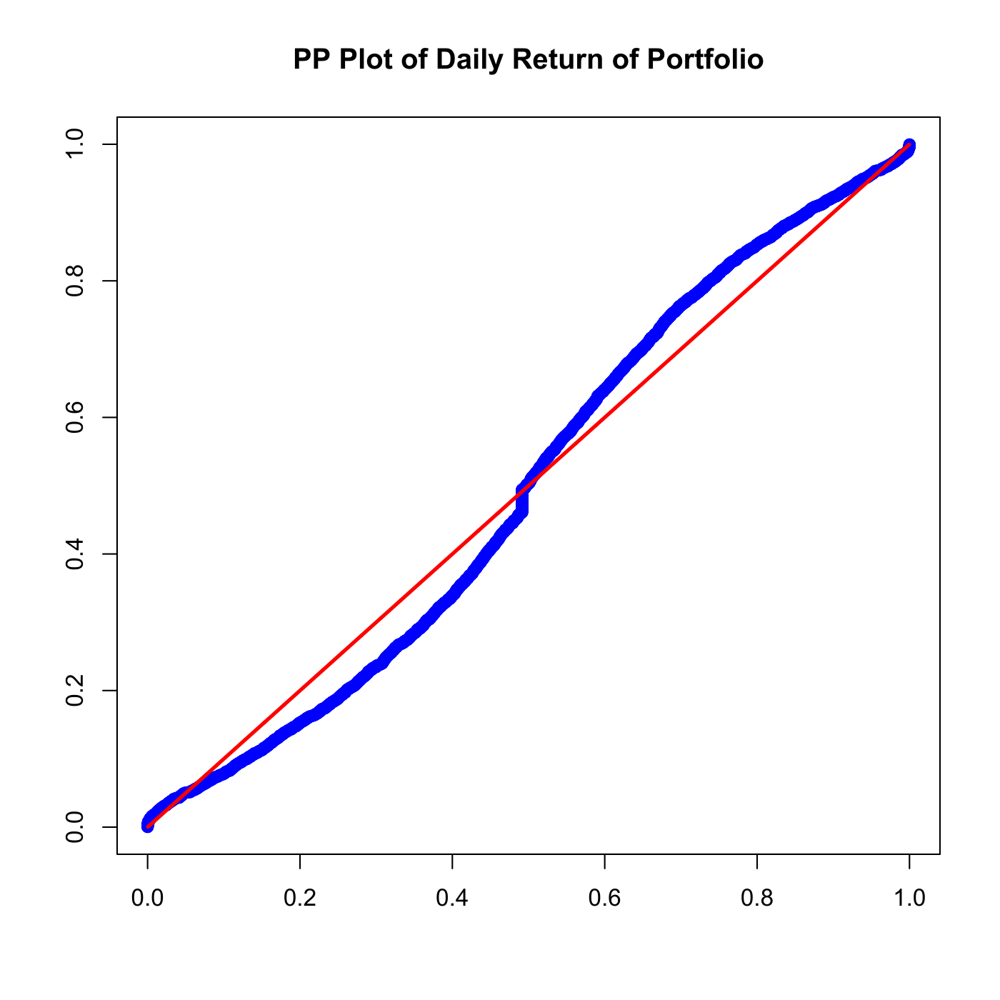
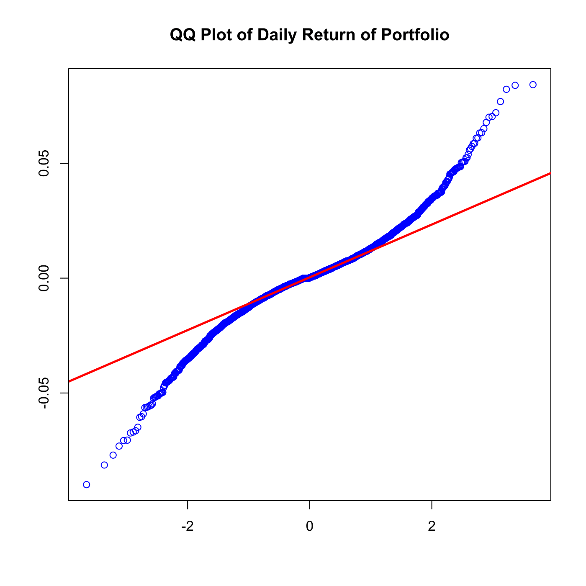

[](http://quantlet.de/)

## [](http://quantlet.de/) **SFSportfolio** [](http://quantlet.de/)

```yaml

Name of QuantLet : SFSportfolio

Published in : SFS

Description : 'Produces a PP and a QQ Plot of the daily log-returns from 1992-01-01 to 2006-12-29
of a portfolio of Bayer, BMW and Siemens stock.'

Keywords : 'asset, data visualization, dax, financial, graphical representation, log-returns, plot,
portfolio, pp-plot, qq-plot, returns'

See also : 'SFSevt2, SFStailGEV, SFSvar_block_max_backtesting, SFSvar_pot_backtesting,
SFSvarblockmaxbacktesting, SFSvarpotbacktesting'

Author : Lasse Groth

Submitted : Wed, August 05 2015 by quantomas

Datafiles : Portf9206_logRet.dat

```






### R Code:
```r
# clear variables and close windows
rm(list = ls(all = TRUE))
graphics.off()

x = read.table("Portf9206_logRet.dat")

n = nrow(x)
xf = apply(x, 2, sort)                          # Sort data in ascending order

t = (1:n)/(n + 1)
dat1 = cbind(pnorm((xf - mean(xf))/sd(xf)), t)  # Determine probabilities
dat2 = cbind(t, t)

# PP Plot
plot(dat1, col = "blue", ylab = (""), xlab = c(""))
lines(dat2, col = "red", lwd = 2.5)
title("PP Plot of Daily Return of Portfolio")

# QQ Plot
dev.new()
qqnorm(xf, col = "blue", xlab = c(""), ylab = c(""), main = ("QQ Plot of Daily Return of Portfolio"))
qqline(xf, col = "red", lwd = 2.5) 
```
