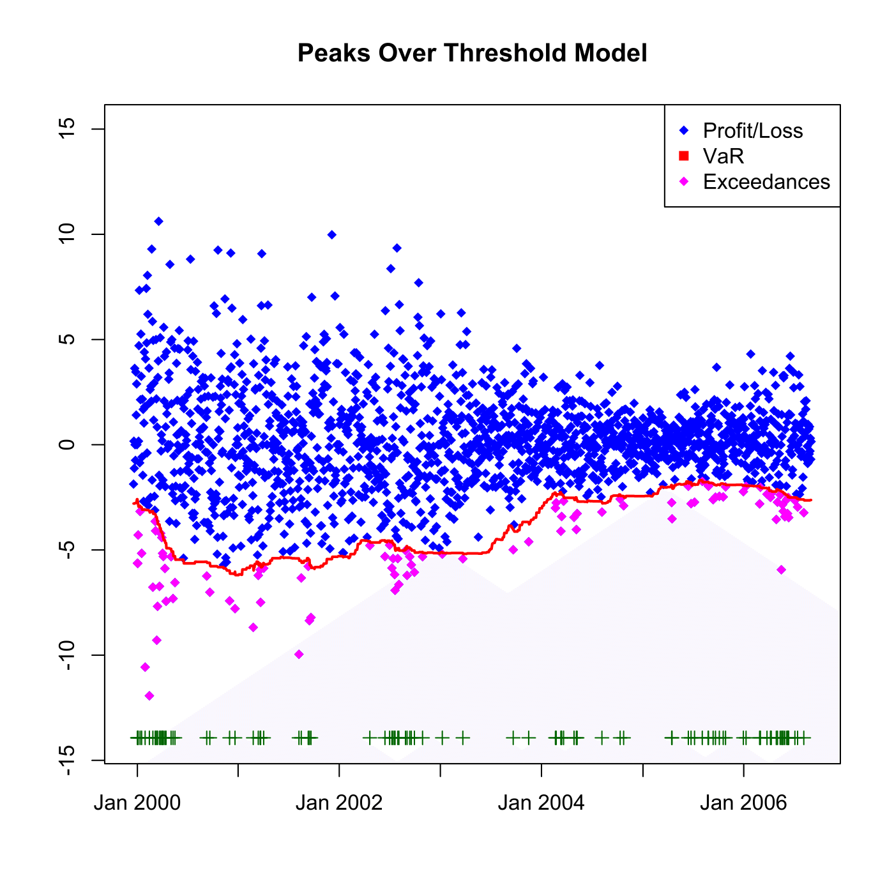

[](http://quantlet.de/)

## [](http://quantlet.de/) **SFSvarpotbacktesting** [](http://quantlet.de/)

```yaml

Name of QuantLet : SFSvarpotbacktesting

Published in : SFS

Description : 'Provides backtesting results for Value-at-Risk under the Peaks Over Treshold model
with generalized Pareto distribution with 0.05 level for the portfolio formed by Bayer, BMW,
Siemens shares during from 1992-01-01 to 2006-09-01.'

Keywords : 'POT, VaR, backtest, data visualization, estimation, exceedance, financial, forecast,
generalized-pareto-model, graphical representation, pareto, plot, portfolio, risk, time-series'

See also : 'SFSportfolio, SFStailGEV, SFStailGPareto, SFStailport, SFSvar_block_max_backtesting,
SFSvar_block_max_params, SFSvar_pot_params'

Author : Lasse Groth

Submitted : Wed, August 05 2015 by quantomas

Datafiles : 'Bay9906_close_2kPoints.txt, Bmw9906_close_2kPoints.txt, Sie9906_close_2kPoints.txt,
VaR9906_pot_Portf.txt'

Input: 
- x,y,z: vector of returns
- v: values of Value-at-Risk
- h: size of the window

Output: 
- p: exceedance ratio
- Plot: the Value-at-Risk estimation results for a portfolio of Bayer, BMW and Siemens stock.

```




### R Code:
```r
# clear variables and close windows
rm(list = ls(all = TRUE))
graphics.off()

# install and load packages
libraries = c("matlab")
lapply(libraries, function(x) if (!(x %in% installed.packages())) {
    install.packages(x)
})
lapply(libraries, library, quietly = TRUE, character.only = TRUE)

# load data
v = read.table("VaR9906_pot_Portf.txt")
x = read.table("Bay9906_close_2kPoints.txt")
y = read.table("Bmw9906_close_2kPoints.txt")
z = read.table("Sie9906_close_2kPoints.txt")

# Size of window
h = 250
v = -v
V = x + y + z
d = dim(V)

L = V[-1, ] - V[1:(d[1] - 1), ]
T = length(L)


outlier = matrix(, 1, T - h)
exceedVaR = matrix(, , )

# Check for exceedances
exceedVaR = (L[(1 + h):(d[1] - 1)] < v[1:(T - h)]) 

# Find exceedances
for (j in 1:(T - h)) {
    if (exceedVaR[j] == TRUE) 
        {
            outlier[j] = L[j + h]
        }  
}

K = find(is.finite(outlier))
outlier = outlier[K]

# Calculate the exceedance ratio
p = round(sum(exceedVaR[1, ])/(T - h), 4)  
v = t(v)

# Plot the values, VaR estimation and the exceedances
plot(L[(h + 1):(d[1] - 1)], pch = 18, col = "blue", xlim = c(-3, 1755), ylim = c(-14, 
    15), xlab = c(""), ylab = c(""), axes = FALSE)
box()
axis(1, c(261, 521, 782, 1043, 1304, 1566, 1826) - 250, c("Jan 2000", "Jan 2001", 
    "Jan 2002", "Jan 2003", "Jan 2004", "Jan 2005", "Jan 2006"))
axis(2)
title("Peaks Over Threshold Model")

points(K, outlier, pch = 18, col = "magenta")
lines(v, col = "red", lwd = 2)

yplus = K * 0 + min(L[(h + 1):(d[1] - 1)]) - 2
points(K, yplus, pch = 3, col = "dark green")

legend("topright", c("Profit/Loss", "VaR", "Exceedances"), pch = c(18, 15, 18), col = c("blue", 
    "red", "magenta"))

# Print the exceedances ratio
print(paste("Exceedances ratio:", "", p)) 
```
