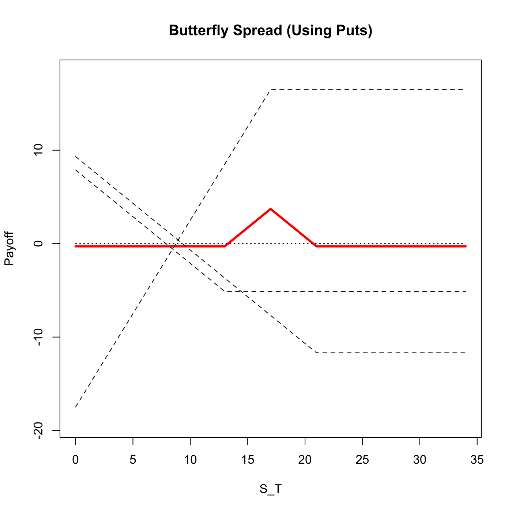
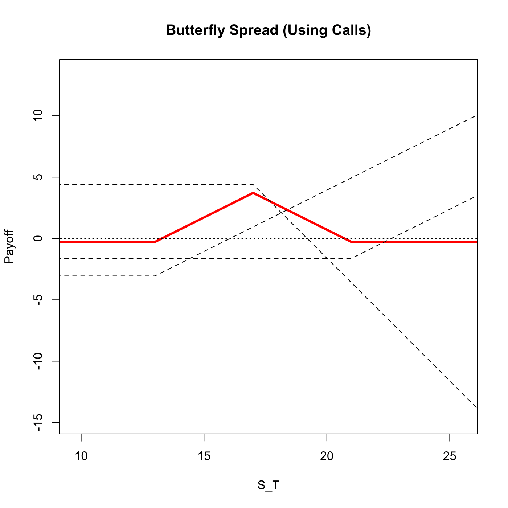

[](http://quantlet.de/)

## [](http://quantlet.de/) **SFSbutterfly** [](http://quantlet.de/)

```yaml

Name of QuantLet : SFSbutterfly

Published in : 'Statistics of Financial Markets : Exercises and Solutions'

Description : 'Plots a butterfly option strategy either produced with call or put options. The
combination of two long puts/calls with strike prices of K1 and K3 and two shorted puts/calls with
strike price K2=0.5*(K1+K3).'

Keywords : 'asset, black-scholes, call, put, derivative, european-option, financial, graphical
representation, option, option-price, plot, price, simulation, stock-price'

See also : SFSbottomstrangle, SFSbottomstraddle, SFSpayoffcollar, SFSstrap, SFSstrip, SFSbitreeNDiv

Author : Lasse Groth

Submitted : Tue, December 22 2009 by Lasse Groth

Input: 
- St: Stock price
- K1: Exercise price put/call 1
- K3: Exercise price put/call 3
- r: Interest rate
- T: Time to expiration
- sigma: Volatility
- flag: 1 for calls, 0 for puts

Example: 
- 1: 'An example is produced for the values: St=10, K1=13, K3=21, T=3, sigma = 0.5, r=0.03, flag =
0.'
- 2: 'An example is produced for the values: St=10, K1=13, K3=21, T=3, sigma = 0.5, r=0.03, flag =
1.'

```






### R Code:
```r

# clear variables and close windows
rm(list = ls(all = TRUE))
graphics.off()

butterfly = function(St, K1, K3, r, T, sigma, flag) {
    if (K1 > K3) 
        print("K3 must be larger than K1") else {
        
        # Calculate K2
        K2 = 0.5 * (K1 + K3)
        K = c(K1, K2, K3)
        
        # Calculate the terms for the BS option prices
        d1 = (log(St/K) + (r + sigma^2/2) * T)/(sigma * sqrt(T))
        d2 = d1 - sigma * sqrt(T)
        
        # Set the coordinates
        x = c(0, K[1], K[2], K[3], K[3] + K[1])
        
        if (flag == 1) {
            cal = numeric(3)
            # Calculate to plain vanilla call option prices
            for (i in 1:3) {
                cal[i] = St * pnorm(d1[i]) - K[i] * exp(-r * T) * pnorm(d2[i])
            }
            
            # Value of plain vanilla options at time T
            cal_T = cal * exp(r * T)
            
            # Calculate the payoff at each coordinate
            y1 = c(-cal_T[1], -cal_T[1], -cal_T[1] + K[2] - K[1], -cal_T[1] + K[3] - 
                K[1], -cal_T[1] + K[3])
            y2 = 2 * c(cal_T[2], cal_T[2], cal_T[2], cal_T[2] - K[3] + K[2], cal_T[2] - 
                K[1] - K[3] + K[2])
            y3 = c(-cal_T[3], -cal_T[3], -cal_T[3], -cal_T[3], -cal_T[3] + K[1])
            
            # Determine the strategy payoff
            y = y1 + y2 + y3
            
            # Plot butterfly option strategy payoff
            plot(x, y, type = "l", lwd = 3, col = "red", xlab = "S_T", ylab = "Payoff", 
                xlim = c(0.75 * x[2], 0.75 * x[5]), ylim = c(0.5 * y2[5], 0.75 * 
                  y1[5]))
            title("Butterfly Spread (Using Calls)")
            
            # Plot plain vanilla option payoff profiles
            lines(x, y1, lty = 2)
            lines(x, y2, lty = 2)
            lines(x, y3, lty = 2)
            
            lines(x, c(0, 0, 0, 0, 0), lty = 3)
        }
        if (flag == 0) {
            put = numeric(3)
            
            # Calculate to plain vanilla put option prices
            for (i in 1:3) {
                put[i] = -St * pnorm(-d1[i]) + K[i] * exp(-r * T) * pnorm(-d2[i])
            }
            
            # Value of plain vanilla options at time T
            put_T = put * exp(r * T)
            
            # Calculate the payoff at each coordinate
            y1 = c(-put_T[1] + K[1], -put_T[1], -put_T[1], -put_T[1], -put_T[1])
            y2 = 2 * c(put_T[2] - K[2], put_T[2] - K[2] + K[1], put_T[2], put_T[2], 
                put_T[2])
            y3 = c(-put_T[3] + K[3], -put_T[3] + K[3] - K[1], -put_T[3] + K[2] - 
                K[1], -put_T[3], -put_T[3])
            
            # Determine the strategy payoff
            y = y1 + y2 + y3
            
            # Plot butterfly option strategy payoff
            plot(x, y, lwd = 3, col = "red", type = "l", xlab = "S_T", ylab = "Payoff", 
                xlim = c(0, x[5]), ylim = c(1.1 * y2[1], 1.1 * y2[5]))
            title("Butterfly Spread (Using Puts)")
            
            # Plot plain vanilla option payoff profiles
            lines(x, y1, lty = 2)
            lines(x, y2, lty = 2)
            lines(x, y3, lty = 2)
            
            lines(x, c(0, 0, 0, 0, 0), lty = 3)
        }
    }
}

butterfly(10, 13, 21, 0.03, 3, 0.5, 0)
```
