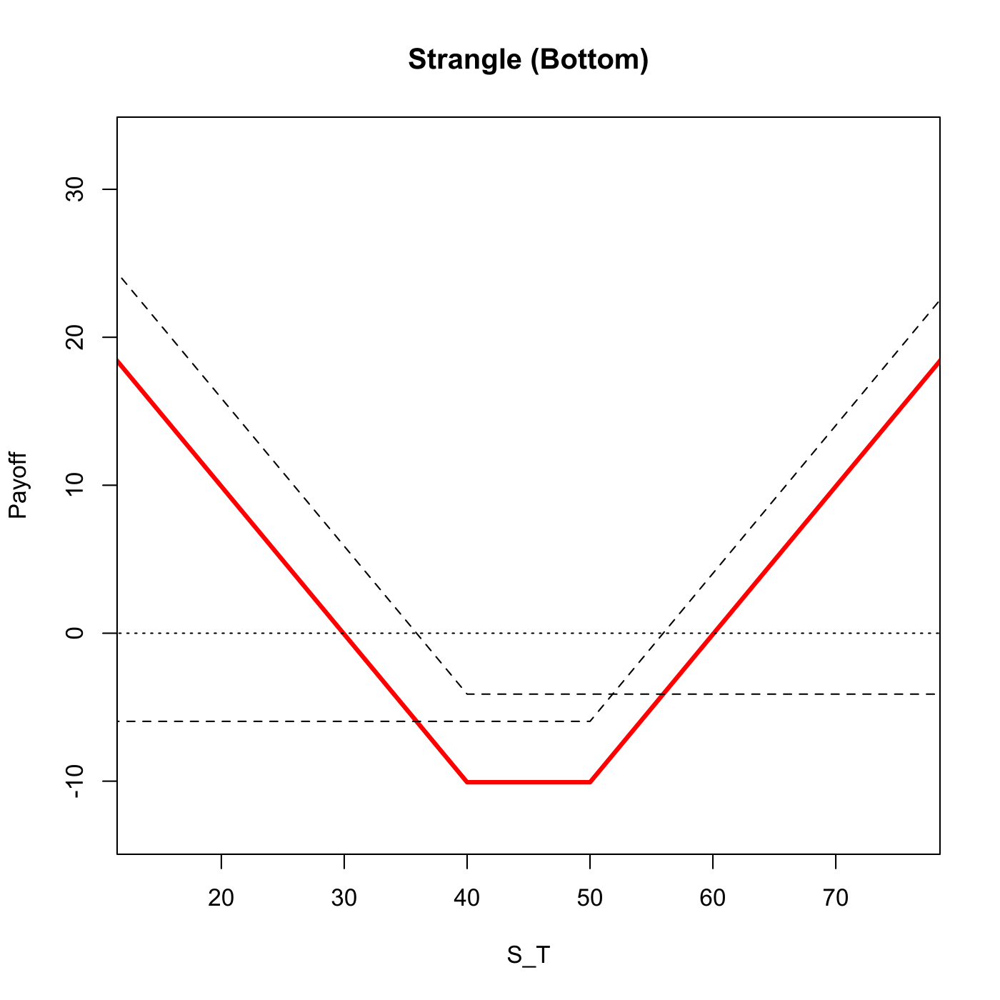

[](http://quantlet.de/)

## [](http://quantlet.de/) **SFSbottomstrangle** [](http://quantlet.de/)

```yaml

Name of QuantLet : SFSbottomstrangle

Published in : 'Statistics of Financial Markets : Exercises and Solutions'

Description : 'Plots the combination of a long call and a long put where the call strike is larger
than the put strike, i.e. a strangle strategy.'

Keywords : 'asset, black-scholes, call, put, derivative, european-option, financial, graphical
representation, option, option-price, plot, price, simulation, stock-price, strike'

See also : SFSbutterfly, SFSbottomstraddle, SFSpayoffcollar, SFSstrap, SFSstrip, SFSbitreeNDiv

Author : Lasse Groth

Submitted : Tue, December 22 2009 by Lasse Groth

Input: 
- St: Stock price
- K1: Exercise price put
- K2: Exercise price call
- T: Time to expiration
- sigma: Volatility
- r: Interest rate

Example : 'An example is produced for the values: St=45, K1=40, K2=50, T=1, sigma = 0.4 and
r=0.03.'

```




### R Code:
```r

# clear variables and close windows
rm(list = ls(all = TRUE))
graphics.off()

bottomstrangle = function(St, K1, K2, T, sigma, r) {
    if (K1 > K2) 
        print("K2 must be larger than K1") else {
        K = c(K1, K2)
        
        # Calculate the terms for the BS option prices
        d1 = (log(St/K) + (r + sigma^2/2) * T)/(sigma * sqrt(T))
        d2 = d1 - sigma * sqrt(T)
        
        # Calculate plain vanilla option prices
        put = -St * pnorm(-d1[1]) + K[1] * exp(-r * T) * pnorm(-d2[1])
        cal = St * pnorm(d1[2]) - K[2] * exp(-r * T) * pnorm(d2[2])
        
        # Value of plain vanilla options at time T
        cal_T = cal * exp(r * T)
        put_T = put * exp(r * T)
        
        # Set the coordinates
        x = c(0, K1, K2, 2 * K2)
        
        # Calculate the payoff at each coordinate
        y1 = c(-cal_T, -cal_T, -cal_T, K2 - cal_T)
        y2 = c(K1 - put_T, -put_T, -put_T, -put_T)
        
        # Combine the payoffs of options to get the strangle strategy
        y = y1 + y2
        
        # Plot strangle option strategy payoff
        plot(x, y, type = "l", lwd = 3, col = "red", xlab = "S_T", ylab = "Payoff", 
            xlim = c(0.35 * K1, K2 + 0.65 * K1), ylim = c(-1.3 * (cal_T + put_T), 
                0.75 * (K2 - max(cal_T, put_T))))
        title("Strangle (Bottom)")
        
        # Plot plain vanilla option payoff profiles
        lines(x, y1, lty = 2)
        lines(x, y2, lty = 2)
        
        lines(x, c(0, 0, 0, 0), lty = 3)
    }
}

bottomstrangle(45, 40, 50, 1, 0.4, 0.03)
```
