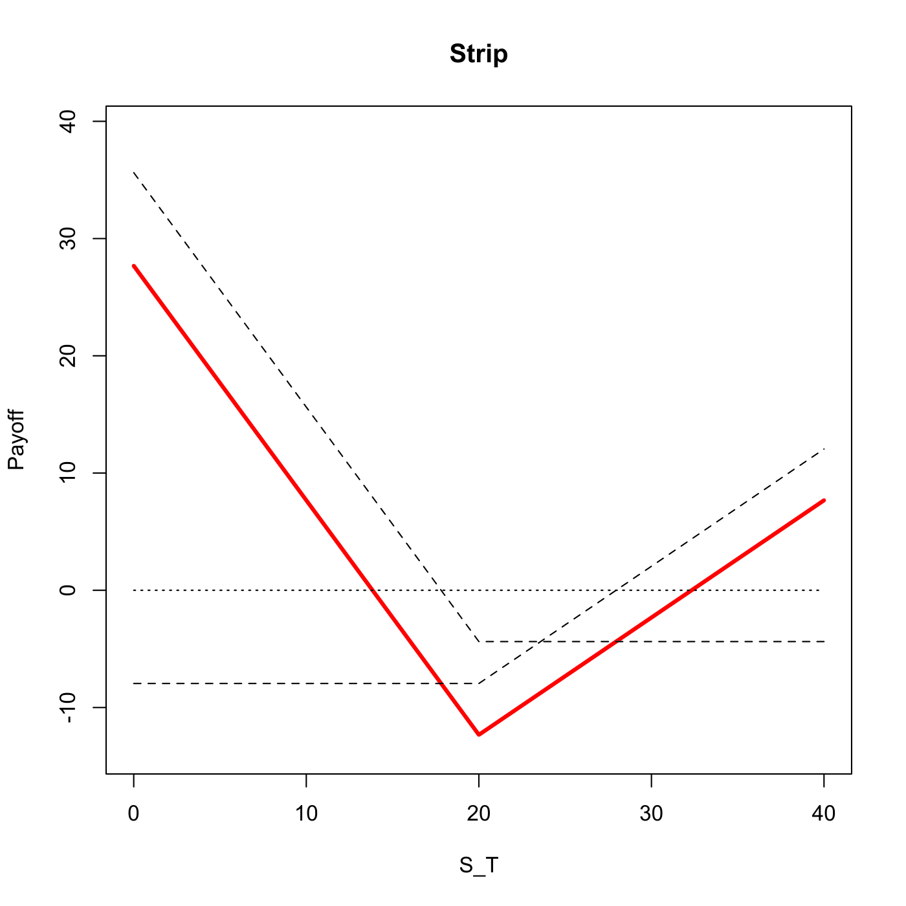

[](http://quantlet.de/)

## [](http://quantlet.de/) **SFSstrip** [](http://quantlet.de/)

```yaml

Name of QuantLet : SFSstrip

Published in : 'Statistics of Financial Markets : Exercises and Solutions'

Description : 'Plots a strip option strategy. Uses a long position in one call and two (or more)
puts in anticipation of downward price movement.'

Keywords : 'asset, black-scholes, call, put, derivative, european-option, financial, graphical
representation, option, option-price, plot, price, simulation, stock-price'

See also : 'SFSbutterfly, SFSbottomstraddle, SFSpayoffcollar, SFSstrap, SFSbottomstrangle,
SFSbitreeNDiv'

Author : Lasse Groth

Submitted : Tue, December 22 2009 by Lasse Groth

Input: 
- St: Stock price
- K1: Strike price
- r: Interest rate
- T: Time to expiration
- sigma: Volatility
- n: Ratio of long puts to long calls

Example : 'An example is produced for the values: St=25, K=20, T=1, sigma = 0.5, r=0.03, N = 2.'

```




### R Code:
```r

# clear variables and close windows
rm(list = ls(all = TRUE))
graphics.off()

strip = function(St, K, r, T, sigma, N) {
    
    # Calculate the terms for the BS option prices
    d1 = (log(St/K) + (r + sigma^2/2) * T)/(sigma * sqrt(T))
    d2 = d1 - sigma * sqrt(T)
    
    # Calculate plain vanilla option prices
    put = -St * pnorm(-d1) + K * exp(-r * T) * pnorm(-d2)
    cal = St * pnorm(d1) - K * exp(-r * T) * pnorm(d2)
    
    # Value of plain vanilla options at time T
    cal_T = cal * exp(r * T)
    put_T = put * exp(r * T)
    
    # Set the coordinates
    x = c(0, K, 2 * K)
    
    # Calculate the payoff at each coordinate
    y1 = c(-cal_T, -cal_T, -cal_T + K)
    y2 = N * c(-put_T + K, -put_T, -put_T)
    
    # Combine the payoffs of options to get the strip strategy
    y = y1 + y2
    
    # Plot strip option strategy payoff
    plot(x, y, type = "l", lwd = 3, col = "red", xlab = "S_T", ylab = "Payoff", 
        xlim = c(0, x[3]), ylim = c(y[2] * 1.1, y2[1] * 1.1))
    title("Strip")
    
    # Plot plain vanilla option payoff profiles
    lines(x, y1, lty = 2)
    lines(x, y2, lty = 2)
    
    lines(x, c(0, 0, 0), lty = 3)
    
}

strip(25, 20, 0.03, 1, 0.5, 2)
```
