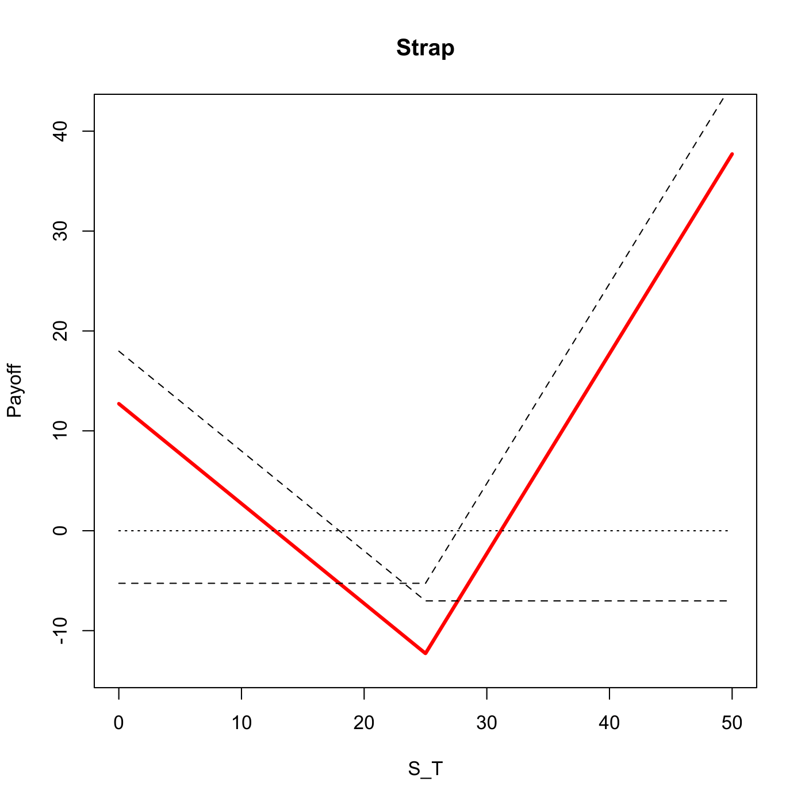

[](http://quantlet.de/)

## [](http://quantlet.de/) **SFSstrap** [](http://quantlet.de/)

```yaml

Name of QuantLet : SFSstrap

Published in : 'Statistics of Financial Markets : Exercises and Solutions'

Description : 'Plots a strap option strategy. It uses a long position in one put and two (or more)
calls in anticipation of upward price movement.'

Keywords : 'asset, black-scholes, call, put, derivative, european-option, financial, graphical
representation, option, option-price, plot, price, simulation, stock-price'

See also : 'SFSbottomstraddle, SFSbottomstraddle, SFSbottomstrangle, SFSbutterfly, SFSpayoffcollar,
SFSpayoffcollar, SFSstrip'

Author : Lasse Groth

Submitted : Wed, December 07 2011 by Dedy Dwi Prastyo

Input: 
- St: Stock price
- K: Strike price
- T: Time to expiration
- sigma: Volatility
- r: Interest rate
- n: Ratio of long calls to long puts

Example : 'An example is produced for the values: St=20, K=25, T=1, sigma = 0.5, r=0.03, N = 2.'

```




### R Code:
```r

# clear variables and close windows
rm(list = ls(all = TRUE))
graphics.off()

strap = function(St, K, T, sigma, r, N) {
    
    # Calculate the terms for the BS option prices
    d1 = (log(St/K) + (r + sigma^2/2) * T)/(sigma * sqrt(T))
    d2 = d1 - sigma * sqrt(T)
    
    # Calculate plain vanilla option prices
    put = -St * pnorm(-d1) + K * exp(-r * T) * pnorm(-d2)
    cal = St * pnorm(d1) - K * exp(-r * T) * pnorm(d2)
    
    # Value of plain vanilla options at time T
    cal_T = cal * exp(r * T)
    put_T = put * exp(r * T)
    
    # Set the coordinates
    x = c(0, K, 2 * K)
    
    # Calculate the payoff at each coordinate
    y1 = N * c(-cal_T, -cal_T, -cal_T + (2 * K - K))
    y2 = c(-put_T + (2 * K - K), -put_T, -put_T)
    
    y = y1 + y2  # Combine the payoffs of options to get the strap strategy
    
    # Plot strap option strategy payoff
    plot(x, y, type = "l", lwd = 3, col = "red", xlab = "S_T", ylab = "Payoff", 
        xlim = c(0, x[3]), ylim = c(y[2] * 1.1, y[3] * 1.1))
    title("Strap")
    
    # Plot plain vanilla option payoff profiles
    lines(x, y1, lty = 2)
    lines(x, y2, lty = 2)
    
    lines(x, c(0, 0, 0), lty = 3)
    
}

strap(20, 25, 1, 0.5, 0.03, 2)

```
